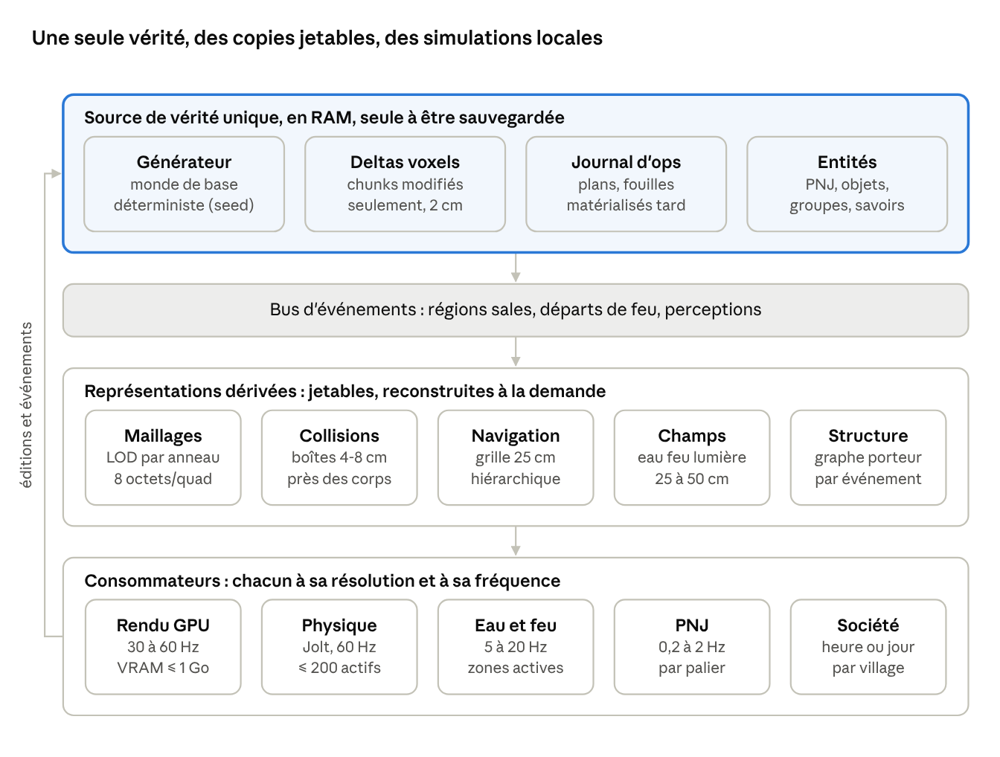

# Architecture moteur basse consommation

Oct 7, 2026 · @Monsieur

## Synthèse

La vision tient sur un GPU intégré à une seule condition : les voxels de 2 cm ne doivent exister, en mémoire comme en calcul, que là où quelqu'un regarde ou agit. Partout ailleurs, le monde est une formule (génération déterministe), un journal d'opérations et des agrégats.

Cadre fixé le 8 octobre : une carte de 20 × 20 km, 500 PNJ en environ 5 villages, et quatre frontières (mer, forêt, montagne, désert) de plus en plus difficiles. Le détail est dans [Monde de 20 km et horizon lointain](https://claude.ai/code/artifact/5175bc3b-2d4d-4c73-ba09-43dbdd07e6dc).

Plusieurs idées de la vision sont incompatibles telles quelles avec les contraintes. Chacune a une version qui devient possible.

| Idée telle quelle | Verdict | Version compatible |
| --- | --- | --- |
| Stocker tout le monde en voxels de 2 cm | Incompatible : 1 km² sur 100 m d'épaisseur = 12 500 milliards de voxels, environ 12 To à 1 octet par voxel | Monde de base généré à la volée depuis une graine, seuls les chunks modifiés sont stockés |
| Afficher les 2 cm partout | Inutile : en 1080p, un voxel de 2 cm fait moins d'un pixel au-delà de 18 m | LOD par anneaux : taille des voxels doublée à chaque doublement de distance |
| Un état dynamique par voxel (température, humidité, dégâts) | Incompatible : multiplie la mémoire par 4 à 10 | Le voxel ne porte qu'une matière ; l'état vit dans des champs clairsemés de 25 à 50 cm |
| Eau et feu simulés voxel par voxel | Incompatible : un seau de 10 L = 1 250 voxels, un étang = des milliards | Hauteurs d'eau par colonne de 25 cm et bassins abstraits ; feu sur grille de 25 à 50 cm |
| Physique par voxel | Incompatible | Corps rigides faits de boîtes fusionnées, effondrements par îlots détachés |
| Stabilité structurelle exacte (éléments finis) | Trop cher pour un monde entier | Connectivité et graphe porteur grossier, calculés seulement après une modification |
| Un Transformer consulté par chaque PNJ à chaque décision | Incompatible sur CPU ; viable sur le GPU dédié réservé à l'IA, sous réserve des données d'entraînement et du contrôle | Utility AI + HTN ; un petit modèle appris reste possible pour des choix sociaux rares |
| Les chantiers des PNJ lointains écrits en voxels en temps réel | Incompatible | Enregistrés comme opérations (plan de maison, fouille) et transformés en voxels quand le joueur approche |
| Mémoire des PNJ en journal illimité | Explose avec le temps | Souvenirs compacts avec oubli et consolidation, faits partagés référencés une seule fois |

L'architecture recommandée repose sur cinq règles.

1. Une seule source de vérité : voxels modifiés, journal d'opérations, entités. Tout le reste (maillages, collisions, navigation, éclairage, champs) est un cache dérivé, jetable, reconstruit par régions sales.
2. Trois LOD au lieu d'un : spatial (résolution selon la distance), temporel (fréquence selon l'importance), causal (on ne simule en détail que ce qui sera observé ou laissera une trace durable).
3. Le voxel ne porte qu'un identifiant de matière sur 16 bits. Tout état dynamique vit ailleurs, à plus basse résolution, et seulement là où il est actif.
4. Rien ne parcourt le monde entier : tout est déclenché par un événement et borné par un budget de temps par image.
5. Ce qui n'est pas observé est résolu par son résultat, pas par son processus : le forgeron du village voisin « produit 3 outils en 2 heures », il ne frappe pas l'enclume.

Moteur par défaut : Godot 4 comme hôte (éditeur, interface, audio, export Steam), avec un cœur C++ indépendant du moteur pour les voxels, les simulations et l'IA, et Jolt pour la physique. La justification est en dernière section.

Une mise en garde sur l'ambition : rivaliser avec GTA 6 sur le rendu est impossible avec un budget de GPU intégré. La concurrence crédible se joue sur la profondeur systémique et sur une direction artistique forte, qui coûte peu.

## Budgets cibles et goulots d'étranglement

Sur un GPU intégré, la limite n'est pas la puissance de calcul mais la bande passante mémoire, partagée avec le CPU (environ 50 à 100 Go/s), puis le nombre de triangles. Chaque octet lu ou écrit par pixel coûte, et chaque milliseconde CPU prise par la simulation est prise au jeu.

Machine de référence retenue par hypothèse : portable avec Intel Iris Xe ou AMD Radeon 680M, 16 Go de RAM (8 Go minimum), CPU 4 cœurs et 8 threads. Rendu interne en 720p à 900p, agrandi en 1080p par upscaling temporel. Objectif 30 images/s sur cette machine, 60 sur un GPU dédié d'entrée de gamme.

| Ressource | Budget | Répartition indicative |
| --- | --- | --- |
| Mémoire GPU | 1 Go maximum | Maillages 300 Mo, champs (lumière, eau) 64 Mo, matières 100 Mo, tampons d'image 80 Mo, ombres 32 Mo, le reste en marge |
| Triangles visibles | 3 millions par image | Après élimination des faces cachées et hors champ |
| RAM du jeu | 4 Go | Voxels chargés 1 Go, caches dérivés 1 Go, entités et IA moins de 100 Mo |
| CPU, thread principal | 8 ms par image | Logique, envoi des commandes de rendu |
| CPU, threads de travail | 3 à 6 threads | Génération, maillage, champs, IA, sauvegarde |
| Envoi vers le GPU | 4 Mo par image | Nouveaux maillages, champs modifiés |
| Sauvegarde | moins de 500 Mo après 100 h de jeu | Deltas compressés et opérations |

Le calcul qui fonde tout le LOD : en 1080p avec un champ de vision vertical de 70°, un pixel couvre 1,1 cm à 10 m. Un voxel de 2 cm fait donc 1,8 pixel à 10 m et 1 pixel à 18 m. Au-delà, la précision de 2 cm est invisible et ne doit plus être payée.

Goulots d'étranglement, du plus grave au moins grave :

1. Explosion cubique des données : 125 000 voxels par mètre cube.
2. Débit de triangles et bande passante du GPU intégré.
3. Coût d'une modification : remaillage, collisions, navigation, éclairage, stabilité, eau, tous déclenchés par un seul coup de pioche.
4. Simulations de champs (eau, feu) si elles suivent la résolution des voxels.
5. Stabilité structurelle, qui est un problème global par nature : un appui retiré en bas change la charge en haut.
6. CPU des PNJ : la recherche de chemin et la perception coûtent bien plus que la décision elle-même.
7. Transitions entre niveaux de détail : passer d'un village simulé en abstrait à un village détaillé sans incohérence. C'est le goulot caché, plus difficile que les autres.
8. Croissance dans le temps : sauvegarde, souvenirs, relations, qui grossissent avec les heures de jeu.

## Architecture globale

Le moteur tient en une phrase : une seule vérité compacte en RAM, des représentations dérivées jetables, et des simulations qui ne tournent que là où c'est pertinent.

Les systèmes ne manipulent jamais la totalité des données. Une modification publie une région sale ; chaque cache concerné se reconstruit pour cette région seulement, à sa propre résolution. La persistance ne lit que la couche du haut, puisque tout le reste se reconstruit.

La séparation demandée (représentation, simulation, physique, rendu, persistance, IA) tient donc, avec une règle : aucun système ne possède sa propre copie de la vérité, chacun ne garde qu'un cache qu'il peut perdre.

Un seul système de pertinence fixe le niveau de détail de tout, selon la distance au joueur et l'importance. Un PNJ qui parle au joueur reste détaillé même à 60 m.

| Zone | Distance | Voxels affichés | Physique | Eau et feu | PNJ |
| --- | --- | --- | --- | --- | --- |
| Proche | 0 à 24 m | 2 cm | Corps rigides actifs | Simulés | Palier 0, complet |
| Locale | 24 à 200 m | 4 à 16 cm | Aucune, objets figés | Simulés à basse fréquence | Palier 1, par tâche |
| Région | 200 m à 3 km | 32 cm à 2,56 m | Aucune | Figés, résolus à l'arrivée | Palier 2, agenda |
| Monde | Au-delà de 3 km | Carte de hauteur | Aucune | Aucun | Palier 3, agrégats |

Le passage d'une zone à l'autre est le point le plus délicat. Quand le joueur arrive, l'état détaillé doit être reconstruit de façon plausible depuis l'état abstrait : où est ce PNJ d'après son agenda, quels voxels ce chantier a déjà posés. C'est pour cela que le générateur et les opérations doivent être déterministes.

## Analyse système par système

Chaque système suit le même ordre : le goulot, les options comparées, la recommandation, ce qui est rejeté.

### 1. Mémoire du monde

Le goulot est le volume : une île de 4 × 4 km sur 200 m d'épaisseur contiendrait 4 × 10¹⁴ voxels. Aucune machine ne peut la stocker, et ce serait inutile puisque presque tout est de la roche jamais vue.

Le monde doit être une fonction, pas un tableau. Il se compose de trois couches :

- **Monde de base** : généré à la volée depuis une graine et des données de conception légères (relief, géologie, routes, lieux). Il coûte zéro octet stocké, à condition d'être strictement déterministe.
- **Deltas** : seuls les chunks touchés par une modification sont stockés.
- **Opérations** : les modifications faites hors de la vue du joueur sont enregistrées comme des ordres compacts (« maison plan 12 au point P, avancement 60 % », « fouille de 30 m³ dans le volume V »). Elles ne deviennent des voxels que quand elles deviennent observables.

En RAM, seule la bulle autour du joueur est chargée, à résolution décroissante. Les PNJ lointains ne lisent jamais les voxels : ils lisent des résumés de région (ressources, bâtiments, stocks). Rejeté : un monde pré-généré et stocké en entier, ou chargé en entier.

### 1 bis. Génération déterministe depuis une seed

La contrainte est compatible, et l'architecture en dépend déjà : une zone se reconstruit à partir de la seed, des paramètres, de la version du générateur, de sa position et de ses modifications. Elle ne coûte presque rien si elle est posée dès le début ; elle devient très chère à ajouter après coup.

Ce que le déterminisme coûte réellement :

| Piège | Pourquoi il casse le déterminisme | Règle retenue |
| --- | --- | --- |
| Calcul flottant | Les opérations de base sont reproductibles, mais sin, exp, pow varient selon le compilateur et le système ; les options d'optimisation et la fusion multiplication-addition changent les arrondis | Flottants stricts comme Box2D (sans fusion multiplication-addition ni optimisations agressives), fonctions mathématiques maison ; entiers pour les hachages |
| Hasard | rand() et les distributions de la bibliothèque standard diffèrent selon les plateformes | Bruits et tirages basés sur un hachage de (seed, position, couche) |
| Multithreading | Un état aléatoire partagé ou un ordre de génération variable donne des mondes différents | Chaque chunk est une fonction pure de (seed, position) ; aucun état partagé, ordre de calcul sans effet |
| GPU | Les résultats varient selon le fabricant et le pilote | Génération de la vérité sur CPU uniquement ; le GPU ne sert qu'aux détails purement visuels |
| Éléments qui débordent (rivières, villages, grottes longues) | Un chunk ne peut pas les générer seul sans dépendre de ses voisins | Génération à deux échelles, voir ci-dessous |
| Version du générateur | Corriger un bug de génération change le monde de base sous les sauvegardes existantes | Version stockée dans la sauvegarde, et chunks modifiés stockés en entier, voir ci-dessous |

Génération à deux échelles. Au démarrage d'une partie, un plan du monde est calculé une fois : régions, relief grossier, réseau de rivières, lacs initiaux, gisements, villages, routes. Il pèse quelques mégaoctets et se régénère aussi depuis la seed. Ensuite, chaque chunk se génère localement en interrogeant ce plan et les éléments dont l'origine est dans les cellules voisines, dans un rayon borné. C'est ce qui rend la génération locale compatible avec le streaming.

Versions du générateur, le vrai point dur. Un delta n'a de sens que par rapport au monde de base exact qui l'a produit. Je recommande de stocker les chunks modifiés en entier (compressés, la taille est proche d'un diff) plutôt que comme une différence voxel par voxel. Ainsi, seuls les chunks jamais touchés dépendent du générateur. Lors d'une mise à jour qui change la génération, deux options : garder l'ancienne version du générateur pour les anciennes parties (sûr, mais du code à maintenir), ou accepter des raccords visibles entre zones anciennes et nouvelles. Les opérations lointaines pas encore matérialisées doivent l'être avant toute migration.

Deux niveaux de déterminisme à ne pas confondre :

- **Génération** : identique bit pour bit sur toutes les plateformes. Exigé, faisable.
- **Simulation** (physique, eau, feu, PNJ) : reproductible avec la même seed sur la même version et la même plateforme, grâce à un pas de temps fixe et un hasard tiré par système depuis la seed. Suffisant pour les tests, les benchmarks et la plupart des bugs. L'exiger bit pour bit entre plateformes est la contrainte à relâcher : elle coûterait très cher pour la physique et le multithreading, et seul le multijoueur en pas synchronisé en aurait besoin.

Vérification continue : une série de seeds de référence dont on compare l'empreinte des chunks générés sur chaque plateforme et chaque compilateur. Les mêmes seeds servent aux benchmarks et aux expériences de simulation.

### 2. Stockage des voxels

Le goulot est le compromis entre compacité et vitesse de modification, dans un monde entièrement destructible.

| Structure | Accès | Modification | Mémoire | Verdict |
| --- | --- | --- | --- | --- |
| Chunk 64³ découpé en briques 8³ uniformes ou à palette | Direct, en deux sauts | Rapide et locale | Environ 16 Ko pour un chunk de surface, 2 octets pour un chunk plein ou vide | Recommandé |
| Palette et bits par chunk entier | Direct | Rapide | 128 Ko par chunk de surface à 4 bits par voxel | Gaspille sur les zones uniformes |
| Tableau dense | Direct | Très rapide | 512 Ko par chunk en 16 bits | Seulement comme tampon de travail temporaire |
| Octree clairsemé (SVO) | Logarithmique | Lente | Très compact | Non pour la vérité ; utile pour le LOD lointain |
| DAG compressé (SVDAG) | Logarithmique | Très lente (déduplication globale) | Excellent pour du statique | Incompatible comme structure principale d'un monde destructible |
| Codage par plages par colonne | Séquentiel | Moyenne | Bon pour le terrain | Pour le disque, pas pour la RAM |

Recommandation : chunks de 64³ voxels, soit 1,28 m de côté. Le chiffre 64 permet de tenir une rangée dans un entier de 64 bits, ce qui rend le maillage et les tests d'occupation très rapides. Chaque chunk contient 8 × 8 × 8 briques de 8³ voxels ; une brique uniforme coûte 2 octets, une brique mixte une petite palette plus 1 à 4 bits par voxel.

Un voxel n'est qu'un identifiant de matière sur 16 bits dans une palette globale : chêne brut, chêne équarri, granit naturel, granit taillé. La différence entre naturel et construit passe par la matière, sans drapeau supplémentaire. Les variations de couleur viennent d'un bruit calculé dans le shader à partir de la position, donc gratuitement.

Pas d'octree pour la vérité : région, chunk, brique forment déjà une hiérarchie à trois niveaux, plus simple à modifier et à paralléliser. La représentation sur GPU est différente : elle ne contient que des maillages compacts, jamais les voxels.

### 3. Streaming

Le goulot est la vitesse de déplacement : un joueur à cheval à 10 m/s traverse 8 chunks par seconde, et chacun doit être généré, maillé et envoyé avant d'être vu.

- Anneaux concentriques par niveau de LOD. Chaque niveau double la taille des voxels et la distance, donc chaque anneau contient à peu près le même nombre de chunks.
- File de priorité selon la distance, la direction du regard et la vitesse, avec un budget fixe par image (par exemple 4 Mo envoyés au GPU).
- Chaîne asynchrone sur les threads de travail : génération, réductions de résolution, maillage, envoi. Le thread principal ne fait qu'échanger des pointeurs.
- Le grossier arrive toujours d'abord et le fin le remplace : jamais de trou, seulement du flou temporaire.
- Cache en RAM des chunks récents, avec hystérésis pour éviter de charger et décharger en boucle. On régénère le monde de base plutôt que de le stocker.

### 4. Génération du maillage

Le goulot est le nombre de triangles produits et le coût du remaillage après chaque modification.

| Technique | Triangles | Coût CPU | Aspect | Verdict |
| --- | --- | --- | --- | --- |
| Greedy meshing binaire (masques 64 bits) | 5 à 20 fois moins sur les surfaces planes, peu de gain sur l'organique | Environ 0,1 à 0,5 ms par chunk | Cubique net | Recommandé par défaut |
| Surface nets | Un sommet par cellule de surface, sans fusion | Moyen | Lisse | Option à tester pour terre, sable, neige |
| Faces visibles naïves | Très nombreux | Faible | Cubique | Rejeté |
| Dual contouring | Comme surface nets, avec normales stockées | Élevé | Arêtes vives et surfaces lisses | Rejeté : données en plus et cas pathologiques |
| Marching cubes | Les plus nombreux | Moyen | Angles arrondis | Rejeté |
| Aucun maillage, lancer de rayons dans les briques | Aucun | Par pixel, gourmand en bande passante | Parfait | Option à évaluer pour le très proche, risquée sur GPU intégré |

Recommandation : greedy meshing binaire sur CPU, dans un format compact. Un quad tient en 8 octets (position, taille, direction, matière, occlusion ambiante), lus directement par le shader. Les quads d'un chunk sont rangés par direction, ce qui permet d'éliminer d'un coup les faces tournées dans le mauvais sens, soit environ la moitié. L'occlusion ambiante par sommet est calculée pendant le maillage. Seul le chunk modifié est remaillé, plus ses voisins si la modification touche un bord.

Sur l'esthétique : à 2 cm, le cube n'est plus lisible au-delà de quelques mètres. De près, un biseau simulé dans le shader et des normales adoucies suppriment l'effet Minecraft sans ajouter de triangles. L'herbe, les feuilles et les petits objets ne sont pas des voxels mais des instances ; ils ne sont voxelisés que si on les coupe.

### 5. Rendu

Le goulot est la bande passante : sur GPU intégré, un G-buffer épais ou beaucoup de surdessin coûtent plus que les calculs.

- Rendu interne en 720p à 900p, agrandi par upscaling temporel (type FSR). Rendu forward avec pré-passe de profondeur plutôt qu'un G-buffer épais.
- Élimination par chunk : hors champ, occlusion hiérarchique à partir de la profondeur de l'image précédente, faces orientées. Un appel de dessin par lot, pas par chunk.
- Matières : une palette (couleur, rugosité, émission) et des micro-variations procédurales. Pas de texture propre à chaque voxel. Quelques mégaoctets en tout.
- Éclairage : c'est lui qui fera la beauté. Soleil et ciel ; ombres en deux cascades mises en cache, redessinées seulement si le soleil bouge ou si la géométrie change. Lumière indirecte approchée par une grille de sondes grossière (50 cm près du joueur, plus large loin), propagée progressivement sur CPU à partir de l'occupation.
- Atmosphère : brouillard de hauteur, perspective atmosphérique, étalonnage des couleurs. Ces effets coûtent peu, portent l'identité féerique et masquent les transitions de LOD.
- PNJ : maillages animés classiques, avec LOD d'animation. Ce ne sont pas des voxels.
- Lumières ponctuelles (torches, foyers) : nombre plafonné, regroupées au loin.

Rejeté : lancer de rayons matériel et illumination globale lourde de type Lumen, incompatibles avec un GPU intégré.

### 6. LOD

Le goulot n'est pas le LOD lui-même mais les coutures entre niveaux, le popping, et le recalcul des niveaux grossiers après une modification.

- Chaque niveau a des voxels deux fois plus gros, appliqués deux fois plus loin : 2 cm jusqu'à 24 m, 4 cm jusqu'à 48 m, 8 cm jusqu'à 96 m, et ainsi de suite jusqu'à 2,56 m vers 3 km. Au-delà, une carte de hauteur et des imposteurs pour l'horizon.
- La réduction préserve les silhouettes : une cellule grossière est pleine si elle contient surtout de la matière, avec une règle spéciale pour ne pas effacer les murs fins et les poteaux.
- Une modification ne recalcule que la chaîne de niveaux de son propre chunk. Chaque niveau coûte 8 fois moins que le précédent.
- Coutures masquées par des jupes aux bords des chunks, changement de niveau par fondu tramé.
- Le LOD de simulation suit les mêmes anneaux que le LOD visuel. Un seul système de pertinence décide pour tout le monde (voir la section architecture).

### 7. Destruction

Le goulot est la cascade : un coup de pioche touche les voxels, puis le maillage, les collisions, la navigation, l'éclairage, la stabilité et l'eau.

- Toute modification passe par une opération : forme, outil, matière, graine. Les outils deviennent des formes : pioche = volume irrégulier et grossier, pelle = volume régulier, truelle = précision au voxel. C'est cette opération qu'on stocke et qu'on rejoue.
- L'opération publie un événement « région sale » avec sa boîte englobante. Chaque cache dérivé s'y abonne et se met à jour en différé, par ordre de distance au joueur.
- Plusieurs coups dans un même chunk pendant une image donnent un seul remaillage.
- La matière est conservée : les voxels retirés deviennent une quantité dans un sac, un tas ou une charrette. Rien n'est créé ni détruit par magie.
- Les petits débris ne sont pas simulés un par un : au-delà d'un seuil, ils deviennent des particules visuelles et un tas de gravats qui conserve la quantité de matière.

### 8. Physique

Le goulot est double : la stabilité structurelle, qui est globale, et le nombre de corps actifs.

- Moteur de corps rigides existant (Jolt). Un fragment détaché devient un corps fait de boîtes fusionnées à 4 ou 8 cm, jamais de voxels individuels. Sa masse est la somme de ses matières, calculée une fois.
- Collisions avec le monde : générées à la demande, seulement autour des corps actifs et des personnages.
- Mise en sommeil agressive et plafond d'environ 200 corps actifs ; au-delà, les plus anciens deviennent des gravats statiques. Hors de la zone proche, aucune physique : les objets sont des données.
- Stabilité en deux étages. D'abord la connectivité : après une modification, un remplissage borné sur une grille de 16 à 32 cm trouve les îlots détachés du sol, qui tombent. Ensuite la charge : un graphe porteur grossier (cellules de 32 cm, ou éléments construits comme poutre, mur, pilier) où chaque matière a une résistance et une portée maximale. Le poids n'est propagé vers les appuis que dans la zone touchée.
- La pierre taillée et la pierre naturelle diffèrent par leur matière, donc par leur résistance : une structure bâtie peut être plus solide qu'un assemblage naturel sans règle spéciale.
- L'effondrement est progressif : craquements et poussière avant la rupture. Le danger devient lisible pour le joueur et pour les PNJ, et le calcul s'étale sur plusieurs images.
- Hors de la vue, un tunnel creusé par des PNJ est évalué une seule fois par opération sur le graphe grossier. S'il s'effondre, l'effondrement est un événement enregistré, transformé en voxels à l'arrivée du joueur.

Rejeté : éléments finis, physique par voxel, vérification continue de la stabilité du monde entier.

### 9. Eau

Le goulot est l'échelle : 1 voxel de 2 cm = 8 mL, donc un seau de 10 L occupe 1 250 voxels et un étang des milliards.

| Approche | Coût | Comportement | Verdict |
| --- | --- | --- | --- |
| Hauteur d'eau par colonne de 25 cm (tuyaux virtuels), avec plusieurs couches pour les grottes | Faible, cellules actives seulement | Coule, se répand, remplit, a une hauteur | Recommandé |
| Bassins abstraits (un volume et un niveau) | Presque nul | Parfait au repos | Recommandé pour l'eau stable |
| Automate cellulaire à 2 cm | Énorme | Bon | Incompatible |
| Particules (SPH) | Élevé, sur GPU | Très bon | Incompatible à grande échelle ; possible pour les effets visuels |

- Chaque cellule stocke un volume en litres. Vider un seau ajoute 10 L à une cellule ; l'eau s'écoule tant que les niveaux diffèrent, contre les obstacles tirés de l'occupation réduite.
- L'eau qui ne bouge plus fusionne en bassin : un seul objet avec volume, niveau et contour. Le remplissage d'une cavité se calcule en une fois, sans simuler chaque instant.
- Absorption et évaporation sont calculées paresseusement : une formule du temps écoulé et du sol, appliquée quand quelqu'un regarde.
- Rivières : un écoulement stable précalculé ; seules les perturbations (barrage, dérivation) sont simulées.
- L'humidité laissée alimente le champ du feu et l'état des sols.
- Rendu : une surface construite à partir des hauteurs, des particules pour les chutes d'eau.

### 10. Feu

Le goulot est le même que pour l'eau : un feu par voxel ne passe pas à l'échelle d'un village.

- Champ clairsemé à 25 ou 50 cm. Chaque cellule active porte une température, une quantité de combustible (tirée des matières qu'elle contient), une humidité et une ouverture à l'air.
- L'oxygène est approché par l'ouverture : la part de cellules d'air voisines, recalculée après chaque modification. Une pièce close couve, une porte ouverte ravive.
- Règles simples : la chaleur diffuse, une cellule s'enflamme au-dessus du seuil de sa matière corrigé par l'humidité, la combustion consomme le combustible et produit chaleur et fumée.
- Mise à jour 5 à 10 fois par seconde, sur les seules cellules actives.
- Conséquence sur les voxels : environ chaque seconde, la couche exposée est convertie en charbon ou retirée. Cela déclenche remaillage et stabilité, et une poutre brûlée peut faire tomber un toit.
- Rendu : particules, flammes en panneaux et une seule lumière par foyer.
- Hors de la vue, l'incendie d'un bâtiment est un taux de combustion par bâtiment.

Rejeté : feu booléen, feu par voxel, fumée simulée comme un fluide 3D.

### 11. Objets physiques

Le goulot est le nombre : si chaque outil, sac ou pierre est un corps rigide permanent, la physique s'effondre.

- Les objets sont des entités (type, quantité, état) affichées par instances de maillage, pas des voxels.
- Trois états : porté (attaché à un personnage), au repos (données statiques, coût nul), actif (corps rigide seulement pendant le mouvement).
- Les matières extraites sont des quantités. Le transport n'est pas magique : poids et volume limités par le contenant (sac, brouette, charrette). Hors de la vue, un transport est un trajet résolu par sa durée.
- Construire consiste à placer de la matière prise dans un stock. La baguette applique une opération avec la précision permise par le métier, et consomme la matière.
- Une baguette prêtée est un objet avec propriétaire, durée et restrictions (précision maximale, formes permises).

### 12. IA des PNJ

Le goulot n'est pas la décision mais tout ce qui l'entoure : recherche de chemin, perception, et cohérence quand un PNJ change de niveau de détail.

Le Transformer par PNJ, tel que décrit, est incompatible comme moteur principal s'il tourne sur CPU (le GPU dédié réservé à l'IA change ce verdict, voir plus bas). Un modèle de 3 millions de paramètres avec 256 jetons de contexte coûte environ 1,5 milliard d'opérations par décision. 300 PNJ décidant toutes les 3 secondes demandent 150 milliards d'opérations par seconde : l'essentiel d'un CPU portable, ou une concurrence directe avec le rendu sur le GPU intégré. Trois problèmes sont plus graves que le coût :

- **Données** : aucun jeu de données comportemental d'une société médiévale n'existe. Il faudrait le fabriquer, et le modèle n'apprendra que ce que ce jeu contient.
- **Contrôle** : un comportement absurde ne se corrige pas en changeant une règle, il faut réentraîner.
- **Déterminisme** : une inférence en flottants sur GPU varie d'une machine à l'autre, ce qui casse la matérialisation paresseuse et la reproduction des bugs.

| Approche | Coût par décision | Contrôle du concepteur | Émergence | Verdict |
| --- | --- | --- | --- | --- |
| Utility AI | Quelques microsecondes | Élevé, courbes lisibles | Bonne | Cœur de la décision |
| HTN | Faible à moyen | Élevé | Moyenne | Plans de métier : forger, bâtir, apprendre |
| Behavior Trees | Très faible | Élevé | Faible | Exécution des étapes, pas la décision |
| GOAP | Moyen à élevé (recherche) | Moyen | Bonne | Remplacé par HTN, plus prévisible |
| Transformer compact | Élevé | Faible | Potentiellement forte | Rôle étroit seulement |
| RL et RL hiérarchique | Très élevé à l'entraînement | Faible | Imprévisible | Rejeté en temps réel ; possible hors ligne pour régler des poids |

Recommandation hybride :

1. Le monde annonce les actions possibles : la forge propose « forger » à qui possède le savoir-faire. Le PNJ n'explore jamais toutes les actions imaginables.
2. L'Utility AI choisit l'objectif à partir des besoins, émotions, personnalité, relations et normes du groupe.
3. Le HTN décompose l'objectif en étapes connues du métier.
4. Des behavior trees ou machines d'états exécutent les étapes.
5. Les PNJ sont simulés par paliers. Palier 0 (vus, moins de 50 m) : décision 1 à 2 fois par seconde, chemin fin, perception. Palier 1 (même village) : décision par tâche, trajet sur graphe sans collisions, actions résolues par leur durée. Palier 2 (région) : agenda et résultats horaires. Palier 3 (lointain) : agrégats de population, devenu inutile avec 500 PNJ (décision du 8 octobre) : tous restent des individus.
6. Avec le GPU dédié réservé à l'IA, un Transformer peut décider pour les PNJ des paliers 0 et 1, par lots, avec une inférence entièrement en entiers pour rester déterministe. Sans GPU dédié, il garde un rôle étroit : les choix sociaux des PNJ de palier 0 (quelle réplique, quelle réaction), en ajustant les scores utilitaires, quelques dizaines de fois par seconde au total. Le simulateur social de la section 14 peut produire son jeu de données.

La recherche de chemin se fait sur une grille de 25 cm, jamais de 2 cm, hiérarchique (type HPA\*), mise à jour par régions sales, avec des chemins en cache et des champs de flux vers les destinations communes (puits, marché). La perception utilise un index spatial des entités et des événements à rayon (bruit, action vue), avec des lignes de vue sur l'occupation grossière, en nombre plafonné.

Ordre de grandeur : 300 PNJ à une décision par seconde, 50 actions et 10 critères chacune, font 150 000 évaluations par seconde, soit moins d'une milliseconde de CPU.

### 13. Mémoire des PNJ

Le goulot est la croissance sans limite et le coût de la recherche dans les souvenirs.

- Un souvenir épisodique est un enregistrement compact d'environ 48 octets : type d'événement, participants, lieu, date, émotion, importance.
- Budget fixe par PNJ (par exemple 256 souvenirs). L'oubli dépend de l'importance et de l'ancienneté.
- Consolidation : des souvenirs répétés deviennent une croyance ou une relation. « Pierre m'a aidé souvent » devient de la confiance, plus deux ou trois souvenirs marquants conservés.
- Mémoire sémantique : les croyances pointent vers des faits du monde stockés une seule fois. Chaque PNJ ne garde qu'une référence, une confiance et une source. Une rumeur est la propagation de ces références, avec déformation possible.
- Recherche par index (participant, lieu, sujet), sans recherche vectorielle.
- Ordre de grandeur : 16 Ko par PNJ, soit 5 Mo pour 300 PNJ. Avec 500 PNJ au total (décision du 8 octobre), le budget peut monter à 50 à 200 Ko chacun, soit 25 à 100 Mo. Les PNJ lointains ne gardent que croyances, relations et événements marquants.

### 14. Simulation sociale

Le goulot est la combinatoire : tout le monde ne peut pas avoir une relation calculée avec tout le monde.

- Relations : graphe clairsemé, au plus 48 relations par PNJ, avec quelques dimensions (affection, confiance, respect, dette, parenté). Pas de matrice complète.
- Institutions comme entités à part entière : famille, guilde, village, culte, seigneurie, avec normes, rôles, ressources et règles d'appartenance. Les sociétés émergent d'institutions qui naissent, fusionnent et disparaissent.
- Échanges sociaux : un catalogue d'interactions (saluer, négocier, accuser, enseigner, courtiser) avec conditions et effets, choisies par l'Utility AI.
- Transmission des métiers : un savoir-faire est un niveau plus des techniques distinctes. L'apprentissage est une relation maître-apprenti dans la durée ; l'apprenti progresse en pratiquant auprès du maître, avec une baguette prêtée. Une technique disparaît quand son dernier détenteur meurt sans l'avoir transmise ; il suffit d'un compteur de détenteurs par technique pour le suivre.
- Économie : offre et demande locales par établissement. Les flux de matière passent par des transports réels : caravanes abstraites au loin, matérialisées de près.
- Fréquence : interactions sociales à l'échelle de l'heure de jeu, institutions à l'échelle du jour, le reste sur événement.
- Outil central : un simulateur sans rendu qui fait vivre 50 ans de société en quelques minutes. C'est là qu'on vérifie l'émergence, et c'est la source de données si un modèle appris est envisagé.

### 15. Persistance

Le goulot est la croissance de la sauvegarde : un chunk modifié pèse 2 à 8 Ko compressé, donc 100 000 chunks modifiés font déjà environ 500 Mo.

- Une sauvegarde contient la seed, les paramètres et la version du générateur, les chunks modifiés (palette, codage par plages, compression zstd), les opérations pas encore matérialisées, les entités, et une chronique des événements marquants. Cette chronique est l'histoire du monde : peu coûteuse et précieuse pour le récit.
- Fichiers par région (par exemple 32 × 32 chunks), écriture incrémentale des seules régions sales en arrière-plan, avec un journal pour survivre aux plantages.
- Déterminisme obligatoire du générateur et des opérations, sinon la matérialisation paresseuse donne un résultat différent à chaque chargement.
- Compaction régulière : les opérations anciennes déjà matérialisées sont fusionnées dans les deltas.
- Format versionné dès le premier jour.

## Apports du travail des développeurs (8 octobre)

Le fil « Projet unifié pour Claude Code » a confronté ce document au code des développeurs (pipeline des PNJ, convertisseur d'assets). Voici ce qui est adopté ici.

- **L'opération comme unité de changement.** Le journal d'opérations et le bus d'événements de ce document ne font qu'un : une opération compacte et rejouable modifie les voxels, prévient les témoins (mémoire des PNJ), se sauvegarde et nourrit la chronique.
- **Un contrat unique entre décision et action**, repris des développeurs : une demande de décision, un plan de 1 à 6 étapes avec conditions d'arrêt et d'interruption, un résultat de plan. La référence Utility AI + HTN et le Transformer distillé le respectent tous deux ; le second doit battre la première pour être retenu.
- **Une décision identique à tous les paliers.** Seules l'exécution et la perception perdent en finesse avec la distance, ce qui garde la cohérence quand le joueur arrive.
- **La mémoire des développeurs** (consolidation, oubli, rumeurs avec dérive, 16 tests) remplace le budget de 256 souvenirs, avec un index et des faits partagés stockés une seule fois.
- **L'identifiant de voxel devient une classe de matière (9 bits) plus une teinte (7 bits)**, car le convertisseur a mesuré que la couleur coûte dix fois plus que la géométrie. Deux règles : le maillage greedy fusionne sur la classe et le shader lit la teinte dans la brique ; le terrain généré garde la teinte 0.
- **Le chantier par différence** des développeurs construit à partir d'instances de modules ; son mode « rituel » devient la matérialisation des chantiers lointains.
- **Le code Python des développeurs sert d'oracle** pour le portage en C++.

Le manque principal côté société est la couche village et institutions : elle passe en tête des priorités.

## Points bloquants et solutions éprouvées

Sur les 13 points bloquants relevés, 8 ont une solution déjà utilisée dans un jeu sorti ou un article publié ; 5 restent sans précédent connu et doivent être traités par les prototypes. La recherche confirme deux choix du document et en corrige un.

- **Confirmé : pas de rayons longs comme dans Teardown.** Teardown, la référence des voxels destructibles, rend ses voxels de 10 cm par lancer de rayons dans des volumes. Il exige une GTX 1060 et déclare les GPU intégrés Intel non supportés. Ce qui est exclu, ce sont ses rayons longs et son éclairage recalculé à chaque image ; des rayons courts limités à une brique de 8 cm restent possibles. Les solutions sont détaillées dans le document « Rendu voxels fins sur GPU intégré ».
- **Confirmé : pas de Transformer comme décideur principal.** Un modèle spécialisé de 1,3 million de paramètres (étude de 2026 sur DOOM) prend 31 ms par décision sur CPU. 300 PNJ décidant toutes les 3 secondes, c'est 100 décisions par seconde, soit 3,1 secondes de calcul par seconde : plus de trois cœurs entiers. Ce verdict ne vaut que sur CPU. Le GPU dédié étant réservé à l'IA, le Transformer y redevient viable pour les PNJ proches : voir le document « Rendu voxels fins sur GPU intégré », section Deux GPU.
- **Corrigé : le déterminisme est possible en flottants.** Box2D a obtenu des résultats identiques sur x64 et ARM, avec MSVC, GCC et Clang, sans virgule fixe et sans perte de performance mesurable. Il suffit d'interdire les optimisations flottantes agressives et la fusion multiplication-addition, et d'écrire ses propres fonctions trigonométriques. Jolt propose la même chose avec une option dédiée. Le générateur peut donc rester en flottants stricts.

Pour situer la machine cible : l'Iris Xe (96 EU) fournit environ 2,15 TFLOPS et la Radeon 680M environ 3,4 TFLOPS, toutes deux sur la mémoire système partagée.

| Point bloquant | Solution éprouvée | Où elle a fait ses preuves | Ce qu'il reste à prouver |
| --- | --- | --- | --- |
| Maillage rapide de voxels fins | Greedy meshing binaire : 50 à 200 µs par chunk de 64³ (74 µs en moyenne), 8 octets par quad, lecture directe par le shader | Bibliothèque open source binary-greedy-meshing | Le nombre de triangles à l'écran sur une surface organique à 2 cm |
| Décor lointain très détaillé | DAG compressé par chunks, élimination Hi-Z, visibility buffer : environ 5 % des données en VRAM | Aokana, intégré à Unity (article 2025) | Ne gère pas l'édition : seulement pour les anneaux lointains, reconstruits après modification |
| Stabilité des constructions | Masse par bloc, support vertical (toute chaîne reliée au socle est stable), support horizontal maximal ; calcul seulement à la pose et au retrait | 7 Days to Die | Les arches et voûtes, que ce modèle gère mal, et le passage à des cellules de 32 cm |
| Recalcul après une modification | Seul le morceau modifié est recalculé, le reste de la hiérarchie ne bouge pas | HPA\* (navigation), 7 Days to Die (stabilité) | Le budget de 2 ms par coup de pioche, toutes conséquences comprises |
| Recherche de chemin pour des centaines de PNJ | HPA\* : jusqu'à 10 fois plus rapide que A\*, chemins à 1 % de l'optimal après lissage | Article de Botea, Müller et Schaeffer (2004), très utilisé depuis | Navigation 3D sous terre (tunnels, étages) |
| Eau à quantité finie | Tuyaux virtuels : hauteur d'eau et flux vers 4 voisins par cellule ; 1024 × 1024 cellules à 65 itérations/s sur une carte graphique de 2008 | Jakó et Tóth, Eurographics 2011 | L'eau sur plusieurs étages (grottes), hors du modèle standard |
| Feu et interactions des éléments | Moteur de règles simples : les éléments changent l'état des matières et entre eux, les matières ne s'influencent pas entre elles | « Moteur chimique » de Zelda : Breath of the Wild (GDC 2017) | Le couplage avec l'oxygène et l'effondrement |
| Décision des PNJ | Utility AI à axes multiples, guidée par les données | Guild Wars 2 (GDC 2015, « AI at Massive Scale ») | Le réglage de la personnalité et de la société |
| Plans de métier | HTN : plans faits de séquences d'actions écrites par les concepteurs, tableau partagé par groupe | Horizon Zero Dawn, Killzone 2, Transformers : Fall of Cybertron | Rien de bloquant |
| Centaines de PNJ hors de vue | LOD de simulation : 5 niveaux d'espace (case, pièce, bâtiment, village, monde), tâches réduites à une action atomique, reprise en cours quand le détail remonte | Brom et al. 2007 ; histoire du monde de Dwarf Fortress | La reprise d'un chantier de voxels abstrait en voxels réels |
| Mémoire des PNJ | Score de rappel = récence × 0,5 + importance × 2 + pertinence × 3 ; réflexion déclenchée quand l'importance cumulée dépasse un seuil | Generative Agents (Park et al. 2023) | Le reprendre sans modèle de langage : pertinence par étiquettes, réflexion par règles de consolidation |
| Sauvegarde par régions | Fichier par région de 32 × 32 chunks, en-tête de 8 Kio (positions et dates), secteurs de 4 Kio, chunks compressés | Minecraft (format Anvil) | Rien de bloquant ; zstd à la place de zlib |
| Contenu à 2 cm (nouveau point) | Génération adaptative de villages qui répondent au terrain, aux matières et au biome | Compétition GDMC (génération de villages dans Minecraft) | Tout : voir ci-dessous |

Le treizième point n'était pas dans l'analyse initiale et il est sérieux. À 2 cm, une maison représente des millions de voxels : personne ne pourra modéliser le monde à la main. Toute l'architecture, la végétation et le mobilier devront venir de générateurs (grammaires de formes, plans paramétrés, bibliothèque de modules) qui respectent la seed. C'est aussi ce qui permet aux PNJ de bâtir : un PNJ exécute un plan, il ne sculpte pas.

Ce qui reste sans précédent connu, à traiter en priorité dans les prototypes :

1. Un rendu à 2 cm éditable sur GPU intégré. Aucun jeu publié trouvé ne le fait ; c'est le prototype 1.
2. Le LOD de voxels cubiques après modification. Voxel Tools pour Godot (licence MIT) le signale encore comme un chantier en cours ; il reste une base de départ utile pour le maillage cubique avec occlusion ambiante, l'édition et le streaming.
3. La stabilité des arches, voûtes et grottes, au-delà du modèle de 7 Days to Die.
4. L'eau sur plusieurs étages souterrains.
5. Le passage cohérent d'un chantier abstrait à des voxels réels quand le joueur arrive.

## Moteur par défaut et ordre des prototypes

Choix par défaut : Godot 4 comme hôte, avec un cœur C++ indépendant du moteur pour les voxels, les champs, la stabilité, l'IA et la société. Ce cœur est une bibliothèque : on peut changer d'hôte plus tard sans le réécrire.

| Option | Atouts | Limites | Verdict |
| --- | --- | --- | --- |
| Godot 4 + cœur C++ (GDExtension) | Léger, open source, sans redevance ; Jolt intégré et moteur physique par défaut depuis Godot 4.6 ; accès bas niveau au rendu Vulkan | Outillage moins mûr, rendu du terrain à écrire soi-même | Recommandé |
| Unity | Écosystème, Burst et Jobs pour le calcul | Moins de contrôle sur le rendu bas niveau, politique de licence instable par le passé | Possible |
| Unreal 5 | Rendu haut de gamme | Nanite et Lumen pensés pour GPU dédiés ; voxels dynamiques hors de son modèle | Non |
| Moteur maison (C++ ou Rust, Vulkan) | Contrôle total | Des années d'outillage (éditeur, audio, interface, export) avant le jeu | Non pour commencer |
| Bevy (Rust) | ECS natif | Jeune, API encore instable | Non |

Les chiffres de ce document sont des estimations. Chaque prototype les mesure sur la machine de référence avant de passer au suivant, dans l'ordre des risques :

1. Voxels, génération, maillage et LOD. Critère : 30 images/s en 1080p (720p interne), 2 km de vue, moins de 1 Go de mémoire GPU.
2. Modifications, remaillage et effondrements. Critère : un coup de pioche traité de bout en bout en moins de 2 ms, un pont qui cède de façon lisible.
3. Eau et feu sur champs. Critère : vider 100 seaux et incendier un village sans passer sous 30 images/s.
4. 500 PNJ en 5 villages, par paliers (Utility AI, HTN, navigation). Critère : moins de 3 ms de CPU par image.
5. Simulateur social sans rendu. Critère : 500 PNJ en 5 villages , un an de jeu en moins de 10 minutes et 50 ans en une nuit, avec transmission et perte de métiers observables.
6. Persistance et matérialisation paresseuse. Critère : revenir dans un village après 10 ans de jeu et le retrouver cohérent.

Les prototypes 1 et 5 peuvent avancer en parallèle : l'un ne touche que le monde, l'autre que la société.

## Sources

Pages consultées le 7 octobre 2026.

- [Teardown, configuration requise](https://get-teardown.readthedocs.io/en/latest/tech/system-requirements.html) et [analyse du rendu de Teardown (acko.net)](https://acko.net/blog/teardown-frame-teardown/)
- [binary-greedy-meshing (GitHub)](https://github.com/cgerikj/binary-greedy-meshing)
- [Aokana : rendu de voxels piloté par le GPU pour mondes ouverts (arXiv 2025)](https://arxiv.org/html/2505.02017v1)
- [Voxel Tools pour Godot (GitHub)](https://github.com/Zylann/godot_voxel)
- [Godot 4.6, notes de version](https://godotengine.org/releases/4.6/)
- [Jolt Physics, options de compilation](https://raw.githubusercontent.com/jrouwe/JoltPhysics/master/Build/README.md)
- [Box2D : déterminisme multiplateforme (2024)](https://box2d.org/posts/2024/08/determinism/) et [Glenn Fiedler : Floating Point Determinism](https://new.gafferongames.com/post/floating_point_determinism/)
- [Iris Xe 96 EU (TechPowerUp)](https://www.techpowerup.com/gpu-specs/iris-xe-graphics-96eu-mobile.c3881) et [Radeon 680M (TechPowerUp)](https://techpowerup.com/gpu-specs/radeon-680m.c3871)
- [7 Days to Die : Structural Integrity](https://7daystodie.wiki.gg/wiki/Structural_Integrity)
- [Botea, Müller, Schaeffer : Near Optimal Hierarchical Path-Finding](https://webdocs.cs.ualberta.ca/%7emmueller/ps/hpastar.pdf)
- [Jakó, Tóth : Fast Hydraulic and Thermal Erosion on GPU (Eurographics 2011)](https://diglib.eg.org/bitstreams/a5c270b1-da1c-498d-bb6d-5fa372ec54e0/download)
- [GDC 2017 : le moteur chimique de Breath of the Wild (Thumbsticks)](https://www.thumbsticks.com/gdc-17-breath-of-the-wild-science-lies)
- [Dave Mark : Infinite Axis Utility System](https://gameai.com/iaus.php)
- [Behind the AI of Horizon Zero Dawn (Game Developer)](https://gamedeveloper.com/design/behind-the-ai-of-horizon-zero-dawn-part-1-)
- [Brom et al. : Simulation Level of Detail for Virtual Humans (2007)](https://artemis.ms.mff.cuni.cz/main/papers/IVE_IVA07.pdf)
- [Dwarf Fortress Wiki : World activities](https://dwarffortresswiki.org/World%20activities)
- [Playing DOOM with 1.3M Parameters (arXiv 2026)](https://arxiv.org/pdf/2604.07385)
- [Generative Agents : flux de mémoire (résumé)](https://agentpatterns.ai/patterns/agent-design/generative-agents-memory-stream/)
- [Minecraft : Region file format](https://minecraft.fandom.com/wiki/Region_file_format)
- [Compétition GDMC (arXiv 2018)](https://arxiv.org/pdf/1803.09853)

À regarder ensuite : la conférence GDC 2026 de Warhorse, [Supporting Thousands of NPCs in Kingdom Come: Deliverance](https://schedule.gdconf.com/session/supporting-thousands-of-npcs-in-kingdom-come-deliverance-kingdom-come-deliverance-ii/915120). Son contenu détaillé n'est pas public en dehors de la GDC Vault.
