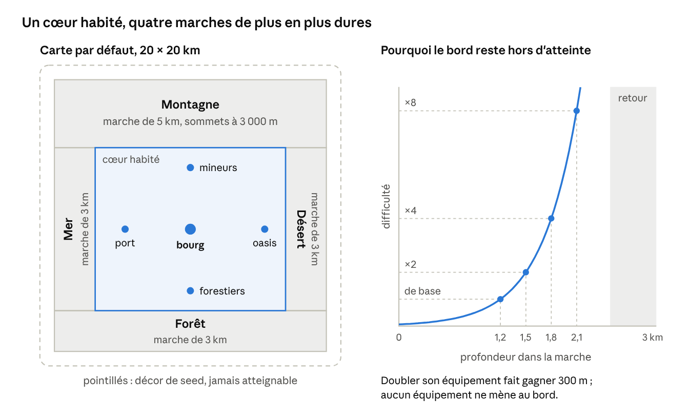
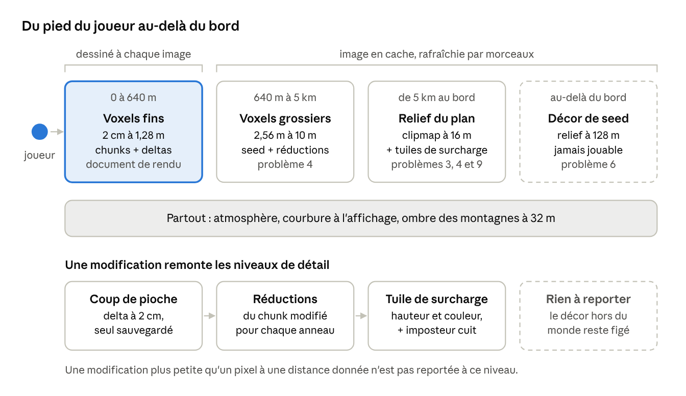

# Monde de 20 km et horizon lointain

Oct 7, 2026 · @Monsieur

## Décisions du 8 octobre

Trois choix ont été faits le 8 octobre ; tout le document en tient compte.

- **Carte : 20 × 20 km par défaut.** Monsieur a proposé de la réduire, et je retiens 20 km. Avec 500 habitants, 2 500 km² resteraient vides (un habitant pour 5 km²), alors qu'à 400 km² les villages restent à quelques heures de marche les uns des autres. La taille n'est qu'un paramètre du générateur : l'architecture est la même de 16 à 50 km.
- **Population : 500 PNJ en environ 5 villages**, tous simulés individuellement, pour que la gestion de l'espace et les déplacements soient réels et que chaque PNJ soit poussé loin.
- **Bords : mer, forêt, montagne et désert.** Chaque côté devient exponentiellement plus difficile : on ne passe jamais vraiment, mais le joueur doit toujours croire que c'est possible, et rêver du monde magique qui se trouve derrière.

## Verdict

Un monde de 20 × 20 km, de 500 m sous terre à 3 000 m d'altitude, peut rester léger, à une condition : il n'existe nulle part en entier. Il existe sous quatre représentations emboîtées, et chacune ne coûte que ce que l'œil peut voir à sa distance.

1. **Un plan du monde à 16 m**, calculé une fois à la création de la partie : relief, rivières, géologie, biomes, environ 8 Mo. Il suffit pour dessiner tout ce qui est au-delà de 5 km.
2. **Un décor de seed** tout autour de la carte, en relief grossier, jamais jouable, jusqu'à l'horizon.
3. **Des anneaux de voxels**, de 2 cm à 10 m, autour du joueur seulement.
4. **Les modifications**, stockées à part et reportées dans les niveaux au-dessus.

Passer de 50 à 20 km divise par six la surface, le plan et le pire cas de sauvegarde, sans toucher à l'architecture. En contrepartie, depuis un sommet, la carte n'occupe que les 28 premiers kilomètres d'un horizon qui en fait 196 : le décor au-delà du bord porte presque tout le lointain, et les quatre frontières sont conçues pour qu'on ne l'atteigne jamais. Avec 500 habitants, la population cesse d'être un problème d'échelle : chacun est un individu simulé en permanence.

## Ce monde en chiffres

Même sa seule surface ne peut pas être stockée : 1 000 milliards de voxels de surface, soit 1 To à un octet chacun. Tout doit donc venir de la seed. Les chiffres ci-dessous sont calculés, sauf mention contraire ; la troisième colonne rappelle la version à 50 km.

| Grandeur | 20 × 20 km | 50 × 50 km, pour mémoire | Conséquence |
| --- | --- | --- | --- |
| Surface | 400 km² | 2 500 km² | 1 000 milliards de voxels de surface à 2 cm |
| Hauteur totale (de −500 m à +3 000 m) | 3,5 km | 3,5 km | Environ 2 × 10¹⁷ voxels dans la boîte englobante |
| Chunks de 1,28 m | 15 625 par côté, 2 734 par colonne | 39 000 par côté | Il ne faut jamais créer de chunk tout d'air ou tout de roche |
| Plan du monde à 16 m | 1,6 million de cellules, environ 8 Mo | 10 millions, environ 50 Mo | Calculé en quelques dizaines de secondes (estimation) |
| Diagonale de la carte | 28 km | 71 km | Plus grande distance entre deux points jouables |
| Horizon depuis un sommet de 3 000 m (Terre réelle) | 196 km | 196 km | Depuis un sommet, la carte n'est qu'une petite partie de la vue |
| Horizon depuis une colline de 500 m | 80 km | 80 km | Le décor compte dès qu'on prend un peu de hauteur |
| Taille à l'écran d'un sommet de 3 000 m à 20 km | 8,5°, environ 90 pixels en 720p | — | Les montagnes se voient de toute la carte |
| Taille d'un pixel au bout de la diagonale (720p) | Environ 55 m à 28 km | Environ 97 m à 50 km | Le relief à 16 m suffit largement dans la carte |
| Courbure de la Terre à 10, 28, 100 et 196 km | 8 m, 63 m, 785 m, 3 000 m | — | Indispensable dès que le décor va jusqu'à l'horizon |
| Précision d'un flottant 32 bits au coin de la carte | Environ 1 mm (de 8 à 16 km) | 3,9 mm (de 32 à 65 km) | Encore trop proche de la taille d'un voxel : l'origine doit suivre le joueur |
| Densité de population | 1,25 habitant par km² | 0,2 habitant par km² | À 50 km, la plupart des terres ne verraient jamais un PNJ |

Deux constats changent l'architecture. D'abord, dès qu'on prend de la hauteur, la vue porte bien au-delà de la carte : le décor n'est pas un détail, il occupe la majorité de l'horizon. Ensuite, à ces distances un pixel couvre des dizaines de mètres : l'horizon coûte peu, à condition de ne pas le dessiner en voxels.

En prolongeant les anneaux du document de rendu (taille doublée à chaque doublement de distance), 13 anneaux couvrent toute la carte depuis n'importe quel point. Au-delà de 5 km, les grottes et surplombs sont invisibles : une simple carte de hauteur suffit.

## Les quatre frontières

Le but est une illusion honnête. La difficulté est réelle et simulée : le joueur échoue faute de préparation, jamais à cause d'un mur. Rien n'est invisible, rien n'est annoncé.

### Disposition par défaut

Mer à l'ouest, montagne au nord, désert à l'est, forêt au sud. Cet ordre suit le climat : le vent dominant vient de la mer et laisse sa pluie sur la forêt et les montagnes, et le désert est le côté le plus éloigné de la mer. Les coins sont des transitions : fjords entre mer et montagne, plateau aride entre montagne et désert, steppe arborée entre désert et forêt, marais côtiers entre forêt et mer. L'orientation est tirée de la seed.

Chaque côté a une marche : une bande de 3 km entre le cœur habité et le bord de la carte, 5 km côté montagne pour loger des sommets de 3 000 m. Le cœur mesure donc environ 14 × 12 km. La limite d'une marche suit le terrain (trait de côte, lisière, limite des neiges, premières dunes), jamais une ligne droite : une ligne droite trahirait la règle.

### La difficulté exponentielle

Toute la marche est pilotée par un seul champ, la profondeur dans la marche (la distance au bord du cœur habité), lu dans le plan du monde. Chaque danger y double tous les 300 m environ (500 m en montagne), soit un facteur 1 000 sur 3 km. Le réglage est libre.

C'est ce qui entretient la croyance. Améliorer son équipement multiplie sa capacité, ce qui ne fait gagner qu'une distance fixe : doubler la taille de son bateau ou ses réserves d'eau fait gagner environ 300 m. Le joueur va un peu plus loin à chaque tentative, pense qu'un dernier effort suffira, et n'atteint jamais le bord.

| Frontière | Ce qui augmente | Ce qui y attire | Ce qui borne la vue |
| --- | --- | --- | --- |
| Mer | Houle, courants, froid de l'eau, récifs, tempêtes | Poisson, sel, épaves | Brume marine |
| Forêt | Densité et sous-bois, obscurité, perte d'orientation, loups et ours | Bois d'œuvre, gibier, plantes | La canopée : on n'y voit qu'à 50 ou 100 m |
| Montagne | Altitude, froid, pente, éboulis, avalanches, crevasses | Minerais, pierre, cristaux, pâturages d'été | Nuages, tempêtes de neige |
| Désert | Chaleur, soif, dunes mouvantes, tempêtes de sable | Sel, sable à verre, minerais et plantes rares | Brume de chaleur, sable en suspension |

La dernière colonne sert deux fois : elle entretient le mystère et réduit le coût du rendu dans les marches.

### Le retour

Près du bord, aucun équipement ne suffit. Le joueur n'y rencontre pas de mur : il s'effondre (naufrage, hypothermie, soif, égarement à la nuit tombée) et se réveille à l'entrée de la marche, ramené par des gens du village le plus proche. Ce sauvetage est un événement de la simulation sociale : une dette, une rumeur, une histoire racontée au bourg.

Le même mécanisme couvre les façons d'avancer qu'un monde destructible permet. Un tunnel sous la montagne ou le désert rencontre une roche de plus en plus dure, des galeries inondées et un air qui manque. Une forêt défrichée par des dizaines de PNJ repousse, et les bêtes s'y multiplient. Le fond du monde, à −500 m, suit la même règle. Une limite de dernier recours existe au bord de la carte, mais un joueur normal ne doit jamais l'atteindre.

### Les PNJ suivent les mêmes règles

Les marches ne sont pas un décor réservé au joueur. Les PNJ y vont chercher du bois, du sel ou du minerai, et y courent les mêmes dangers. Ceux qui vont trop loin ne reviennent pas. Leurs disparitions nourrissent des légendes, et la simulation sociale décide de ce que les villages en font : peur, culte, défi lancé aux jeunes. L'au-delà devient un sujet de conversation et de croyance, pas seulement une image.

### Faire rêver de l'au-delà

Le décor derrière le bord n'est jamais atteint : il peut donc montrer, avec retenue, ce que la carte ne montrera jamais. Des lumières sur une côte lointaine la nuit, une colonne de fumée, une tour sur un sommet de 6 000 m, une ville en mirage qui recule quand on avance, une voile à l'horizon qui n'arrive jamais, un mur d'arbres immenses au-dessus des collines, une citadelle sur un col. Des choses en arrivent aussi : du bois flotté sculpté sur la plage, des oiseaux migrateurs, un étranger mort dans la neige avec des objets inconnus. De rares voyageurs aussi, venus de derrière, mais jamais en état de servir de guide : naufragés ou mourants, leur récit est fragmentaire et invérifiable. Ces indices ne coûtent presque rien : quelques silhouettes dans l'image en cache, et des événements tirés de la seed.

## Problèmes et solutions

Treize problèmes naissent de l'échelle. Tous ont une solution déjà utilisée ailleurs ou déductible de techniques connues. Les deux qui demandaient une décision de conception, le bord du monde et la population, sont tranchés depuis le 8 octobre.

### 1. Précision des nombres loin de l'origine

Entre 32 et 65 km de l'origine, un flottant 32 bits avance par pas de 3,9 mm. Sur une carte de 20 km, on reste à moins de 14 km du centre, où le pas est d'environ 1 mm. C'est mieux, mais la documentation de Godot conseille de rester sous 2 à 4 km de l'origine pour un jeu à la première personne, faute de quoi les objets tremblent et la physique devient incohérente.

Solution : les positions du monde sont des entiers (indice de chunk) plus un décalage flottant dans le chunk. Le rendu est relatif à la caméra, et l'origine suit le joueur : elle est déplacée dès qu'il s'en éloigne de 1 à 2 km. La physique n'existe qu'autour du joueur, donc des flottants 32 bits locaux lui suffisent. Godot propose aussi une version double précision, et Jolt une option du même type, mais avec un coût CPU et mémoire et l'obligation de recompiler les extensions ; notre cœur en C++ n'en a pas besoin s'il gère lui-même ses coordonnées.

### 2. Une colonne de 2 734 chunks

Presque tous ces chunks sont de l'air ou de la roche pleine. Les créer serait un gaspillage.

Solution : chaque colonne connaît, grâce au plan du monde, l'altitude minimale et maximale de sa surface. Un chunk au-dessus est de l'air implicite ; un chunk en dessous, sans grotte, est de la roche implicite. Ni l'un ni l'autre n'existe en mémoire. Les grottes sont décrites dans le plan comme un réseau (galeries, salles, boîtes englobantes), pour qu'un chunk sache immédiatement s'il en contient une. Sous terre, l'horizon est invisible et son coût disparaît.

### 3. Relief, érosion et rivières à l'échelle du monde

Des montagnes crédibles demandent de l'érosion, et des rivières demandent un écoulement global : ce sont des calculs non locaux, incompatibles avec une génération chunk par chunk.

Solution : le plan du monde à 16 m (1 250 × 1 250 cellules, environ 1,6 million, plus le décor autour à 128 m) est calculé une fois à la création de la partie : relief, érosion, réseau de rivières, lacs, géologie, biomes. Ce calcul doit rester déterministe : en entiers, ou en flottants stricts sur CPU. À 20 km, le CPU suffit (quelques dizaines de secondes), ce qui évite toute génération de vérité sur GPU. Le plan est gardé dans la sauvegarde pour ne pas être recalculé. Le détail de 16 m jusqu'à 2 cm vient ensuite, localement, de bruits déterministes et des couches géologiques.

### 4. Dessiner jusqu'à l'horizon

Depuis un sommet de 3 000 m, l'horizon est à 196 km, alors que la carte n'a que 28 km de diagonale : l'essentiel de la vue est du décor.

Solution : jusqu'à environ 5 km, les anneaux de voxels du document de rendu. Au-delà, un geometry clipmap sur le relief du plan, prolongé par celui du décor (128 m, puis 512 m au-delà de 50 km) : des grilles régulières emboîtées centrées sur le joueur. Losasso et Hoppe ont rendu ainsi un relief de 20 milliards d'échantillons (les États-Unis) à environ 90 images par seconde, dans 355 Mo de mémoire. Tout ce lointain va dans l'image en cache du document de rendu, redessinée par morceaux. La profondeur utilise un tampon flottant inversé (reversed-Z), qui selon Nathan Reed supprime presque toutes les erreurs de profondeur et permet un plan lointain à l'infini.

### 5. La courbure de la Terre

Sur un monde plat, un sommet du décor à 100 km paraît 785 m trop haut, et l'horizon ne « tombe » jamais. Avec un décor qui va jusqu'à l'horizon, la courbure devient indispensable.

Solution : courber le monde seulement à l'affichage, dans le shader des sommets (abaisser chaque point de d² / 2R). La simulation reste plate. Le rayon peut être celui de la Terre, ou plus petit pour un horizon plus spectaculaire : c'est un choix artistique sans coût.

### 6. Ce qu'il y a au-delà du bord

Décidé le 8 octobre : mer, forêt, montagne et désert, chacun de plus en plus difficile jusqu'à devenir infranchissable, avec le décor de seed au-delà. Le détail est dans la section « Les quatre frontières ». Le tore et le mur de brouillard restent écartés : le premier montrerait deux fois les mêmes montagnes, le second trahirait la limite.

### 7. Les ombres des montagnes

Au lever et au coucher du soleil, une montagne de 3 km projette une ombre de plusieurs kilomètres. Les cascades d'ombre classiques ne couvrent qu'une centaine de mètres.

Solution : une carte d'ombre des montagnes à 32 m sur la carte et 10 km de décor autour, car les sommets du décor projettent aussi leur ombre (1 250 × 1 250 texels, environ 1,6 Mo). Elle est calculée par un balayage le long de la direction du soleil : on avance en gardant la ligne d'horizon la plus haute rencontrée, et chaque texel sous cette ligne est à l'ombre. Le soleil bouge lentement, donc la carte est recalculée par tranches. Chaque pixel ne fait qu'une lecture de texture. C'est une variante du horizon mapping de Nelson Max (1988). Les travaux récents qui évaluent l'horizon à chaque pixel coûtent 1,3 à 8,8 ms sur une RTX 2050 (HPG 2025) : trop pour nous, d'où le précalcul par position du soleil.

### 8. Atmosphère et perspective aérienne

À 100 km, sans atmosphère crédible, les montagnes semblent collées sur le ciel. L'atmosphère est aussi le meilleur moyen de masquer les changements de niveau de détail.

Solution : la technique de Sébastien Hillaire (Epic, 2020), à base de petites tables précalculées. Elle coûte 0,31 ms au total en 1280 × 720 sur une GTX 1080, et environ 1 ms pour le ciel de Fortnite sur iPhone 6s. Son volume de perspective aérienne couvre 32 km par défaut ; au-delà, pour le décor, la brume peut être calculée par pixel à partir des mêmes tables (à vérifier en prototype).

### 9. Les modifications vues de loin

Un château sur un sommet, une carrière, une forêt brûlée doivent se voir à 20 km.

Solution : chaque modification remonte la chaîne des niveaux de détail. Pour les anneaux de voxels, ce sont les réductions de résolution du chunk. Pour le relief lointain, des tuiles de surcharge du plan à 16 m stockent les changements de hauteur et de couleur, mises à jour quand les modifications d'une zone dépassent un seuil. Les grandes constructions (tours, châteaux) reçoivent un imposteur cuit automatiquement, comme l'Impostor Baker de Ryan Brucks utilisé dans Fortnite pour le lointain. Règle : une modification plus petite qu'un pixel à une distance donnée n'est pas reportée à ce niveau.

### 10. Végétation sur 400 km²

Les forêts se voient jusqu'à l'horizon, mais des milliards d'arbres ne peuvent pas exister en mémoire.

Solution : la position de chaque arbre vient de la seed (un tirage par hachage), et seuls les arbres coupés ou plantés sont enregistrés. Près du joueur, des arbres complets ; à mi-distance, des imposteurs ; au loin, la forêt n'est plus qu'une hauteur de canopée et une couleur dans les tuiles du plan. La forêt de la frontière est la plus dense du monde, mais on n'y voit qu'à 50 ou 100 m : la canopée borne elle-même le coût du rendu.

### 11. L'eau à l'échelle du monde

Solution : le niveau de la mer, les rivières et les lacs viennent du plan. Au loin, l'eau est une surface plate qui reflète le ciel ; de près, c'est le modèle par colonnes du document d'architecture. Une rivière détournée par un barrage est une modification comme une autre, reportée dans les tuiles de surcharge.

### 12. Déplacements rapides

À cheval (10 m/s), le streaming suit sans peine. Un voyage rapide ou une téléportation déplace le joueur sans prévenir.

Solution : le lointain est immédiat puisqu'il vient du plan déjà en mémoire ; seuls les anneaux proches sont à générer, avec un court écran de transition. En hauteur (vol, sommet), les anneaux se mesurent depuis la caméra en 3D : le détail à 2 cm disparaît de lui-même quand le sol est loin.

### 13. La population : 500 PNJ en 5 villages

Décidé le 8 octobre. 500 habitants sur 400 km², c'est peu, environ 1,25 par km², et c'est ce qui rend l'espace réel : chaque village a un territoire, des terres vides le séparent des autres, et chaque déplacement coûte.

- **Plus d'agrégats.** Les 500 PNJ sont tous des individus, simulés en permanence. Les paliers du document d'architecture ne règlent plus que la finesse : perception, animation et chemins au voxel près autour du joueur ; emploi du temps et trajets sur le réseau des chemins au loin. Chacun garde partout sa mémoire et ses décisions.
- **Une mémoire bien plus riche.** Environ 300 souvenirs par PNJ et 1 000 pour les 25 PNJ avancés, soit environ 32 Mo d'état social pour les 500 (estimation commune avec le projet unifié). Côté IA, 500 PNJ restent une petite part du GPU dédié (estimation).
- **Des villages complémentaires.** Disposition proposée : un village près de chaque frontière (port, forestiers, mineurs, oasis) et un bourg de marché au centre, qui porte les institutions. Le port vend poisson et sel et achète bois et grain ; les forestiers vendent bois, gibier et résine et achètent sel et métal ; les mineurs vendent pierre et minerai et achètent nourriture et bois de mine ; l'oasis vend verre et teintures et achète eau, bois et nourriture. Aucun n'est autosuffisant, ce qui force échanges, trajets et conflits.
- **Une rareté voulue.** La bonne terre (vallée fertile, rivière) est volontairement limitée dans le plan, pour que les villages se la disputent malgré l'espace vide autour.
- **Une échelle de temps.** Les distances n'ont de sens qu'avec elle. Défaut proposé : un jour de jeu dure 4 heures réelles (×6). Les villages sont à 4 à 6 km du bourg et à 7 à 11 km les uns des autres. À pied, 5 km prennent alors environ 6 heures de jeu : aller au bourg occupe une demi-journée, on y dort souvent avant de revenir, et ces nuits créent des rencontres. À valider en prototype.

## L'architecture de l'horizon

Seuls les 640 premiers mètres sont redessinés à chaque image. Tout le reste vient du plan du monde, déjà en mémoire, et d'une image en cache : le monde reste léger quelle que soit la distance de vue, et les modifications du joueur se voient de loin sans que le lointain soit jamais voxelisé.

## Sauvegarde à l'échelle de 400 km²

La sauvegarde reste sous 500 Mo après 100 heures si l'on respecte une règle : ce qui peut être rejoué n'est pas stocké. Le danger n'est pas le joueur mais les PNJ. Si les sociétés modifiaient 1 % des chunks de surface en voxels, on stockerait environ 2,5 millions de chunks, soit une dizaine de Go.

Les modifications sont donc rangées en trois classes :

- **Rejouables** : une fouille, un champ labouré, une route, un chantier sont des opérations déterministes de quelques dizaines d'octets. Les voxels qu'elles produisent sont recalculés à chaque chargement et jamais enregistrés, sauf s'ils sont modifiés ensuite à la main.
- **Référencées** : un bâtiment est une liste d'instances de modules (module, position, orientation, graine), quelques dizaines d'octets par instance.
- **Uniques** : seules les modifications à la main, impossibles à rejouer, sont stockées en voxels, chunk par chunk.

| Contenu | Taille unitaire | Volume supposé après 100 h | Total estimé |
| --- | --- | --- | --- |
| Plan du monde (recalculable depuis la seed) | — | 1 | Environ 8 Mo |
| Décor de seed autour de la carte | — | Recalculé à chaque chargement | 0 |
| Chunks modifiés à la main | 2 à 8 Ko | 5 000 à 50 000 | 20 à 400 Mo |
| Opérations rejouables | 32 à 64 octets | 500 000 | 16 à 32 Mo |
| Instances de modules | 16 à 32 octets | 500 000 | 8 à 16 Mo |
| Tuiles de surcharge du relief lointain | — | Zones fortement modifiées | Moins de 5 Mo |
| PNJ, mémoire et relations | Environ 64 Ko | 500 | Environ 32 Mo |
| Chronique du monde | — | — | Moins de 10 Mo |

Les volumes sont des hypothèses à mesurer en jeu. Le total se situe entre 80 Mo et 500 Mo ; les modifications à la main en font l'essentiel. La cible commune avec le projet unifié est de 500 Mo au plus.

Organisation sur disque : les chunks modifiés sont rangés par régions cubiques de 32 × 32 × 32 chunks (environ 41 m de côté), indexées par une clé de Morton qui mêle les trois coordonnées. Seules les régions modifiées existent : sur des millions de régions possibles, une sauvegarde n'en contient que quelques milliers. Les opérations et instances sont rangées par tuile de 1 km pour être chargées avec le streaming. Une compaction régulière fusionne les opérations anciennes.

## Prototypes pour valider

Ces prototypes complètent ceux du document de rendu. Tous utilisent une seed fixe et se mesurent sur le GPU intégré.

| Prototype | Critère de réussite | Si ça échoue |
| --- | --- | --- |
| 1. Plan du monde de 20 km | Relief, érosion et rivières calculés en moins de 30 secondes à la création, décor compris ; résultat identique au bit près sur deux machines | Plan à 32 m au lieu de 16 m, érosion plus simple |
| 2. Vue depuis un sommet | Carte entière et décor jusqu'à l'horizon visibles avec atmosphère et courbure, lointain en moins de 2 ms GPU en moyenne | Décor à 512 m dès le bord, cache rafraîchi moins souvent |
| 3. Origine flottante | Aucun tremblement visible ni dérive physique au coin de la carte, à 14 km du centre | Version double précision de Godot et de Jolt |
| 4. Ombres des montagnes | Ombre de toute la carte et du décor proche recalculée en moins de 10 ms CPU, par tranches | Résolution de 64 m |
| 5. Modifications vues de loin | Une tour de 30 m construite sur un sommet est visible à 20 km dans la minute qui suit | Imposteurs seulement, sans tuiles de surcharge |
| 6. Voyage rapide | Arrivée jouable en moins de 3 secondes n'importe où sur la carte | Transition plus longue, anneaux proches générés en priorité |
| 7. Sauvegarde | 100 heures simulées (joueur et PNJ accélérés) : sauvegarde sous 500 Mo, chargement sous 10 secondes | Compaction plus agressive |
| 8. Une marche | Des testeurs qui cherchent à passer ne repèrent ni mur ni règle, et chaque amélioration d'équipement les mène un peu plus loin | Marche plus large, vue plus bornée, retour plus tôt |
| 9. Cinq villages, 500 PNJ | Un an de jeu simulé sans joueur en moins de 10 minutes : échanges, trajets et conflits pour la bonne terre, sans PNJ bloqué | Paliers plus grossiers au loin, mémoire plus courte |

Le prototype 1 vient en premier : tout le reste lit le plan du monde.

## Sources

Pages consultées le 7 octobre 2026. Les chiffres marqués comme calculés, estimés ou approximatifs ne viennent pas de ces pages.

- [Godot : Large world coordinates (source de la documentation 4.4)](https://docs.godotengine.org/uk/4.4/_sources/tutorials/physics/large_world_coordinates.rst.txt)
- [Jolt Physics : options de compilation, dont la double précision](https://raw.githubusercontent.com/jrouwe/JoltPhysics/master/Build/README.md)
- [Hoppe : Terrain rendering using GPU-based geometry clipmaps](https://hhoppe.com/proj/gpugcm/) et [Losasso et Hoppe : Geometry clipmaps (2004)](https://hhoppe.com/proj/geomclipmap/)
- [Nathan Reed : Depth Precision Visualized](https://www.reedbeta.com/blog/depth-precision-visualized/)
- [Hillaire : A Scalable and Production Ready Sky and Atmosphere Rendering Technique (Eurographics 2020)](https://diglib7.eg.org/bitstream/handle/10.1111/cgf14050/v39i4pp013-022.pdf)
- [Horizon mapping (Wikipédia)](https://en.wikipedia.org/wiki/Horizon_mapping)
- [Fast Planetary Shadows using Fourier-Compressed Horizon Maps (HPG 2025)](https://highperformancegraphics.org/untracked/2025/presentations/Pa5_2_Fast%20Planetary%20Shadows%20using%20Fourier-Compressed%20Horizon%20Maps.pdf)
- [Impostor Baker pour UE4, Ryan Brucks (80.lv)](https://80.lv/articles/impostor-baker-for-ue4/)

Voir aussi les documents liés du projet : « Architecture moteur basse consommation » et « Rendu voxels fins sur GPU intégré ».
