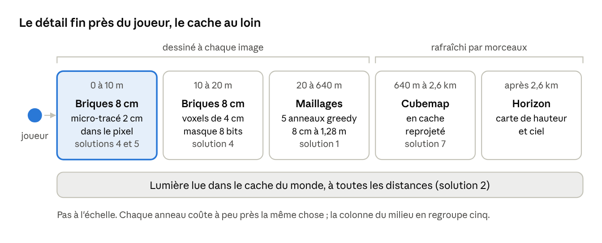

# Rendu voxels fins sur GPU intégré

Oct 7, 2026 · @Monsieur

## Verdict

Le rendu de voxels de 2 cm destructibles sur GPU intégré est possible, mais pas en copiant Teardown. Teardown paie à chaque image, pour chaque pixel, un lancer de rayons dans des volumes et un éclairage entièrement recalculé. Sur un GPU intégré, c'est la bande passante mémoire qui cède, pas la taille des voxels.

Ma formule précédente était trop rapide : le lancer de rayons n'est pas exclu en soi. Ce qui est exclu, ce sont les rayons longs et l'éclairage refait à chaque image. Des rayons très courts, limités à l'intérieur d'une petite brique, restent utilisables et font même partie de la solution proposée.

La contrainte est maintenant claire : le rendu doit tenir sur le GPU intégré seul, parce que le GPU dédié (RTX série 3000, 6 Go) est réservé à l'IA. Cinq conditions rendent cela possible :

1. **Le 2 cm seulement là où il se voit.** En rendu interne 720p, un voxel de 2 cm fait moins d'un pixel au-delà d'environ 12 m. Au-delà, des voxels plus gros suffisent.
2. **Un coût constant par anneau.** Chaque fois que la distance double, la taille des voxels double. Chaque anneau coûte alors à peu près la même chose, et le coût total croît comme le logarithme de la distance de vue, pas comme son carré.
3. **La géométrie par rastérisation, le détail fin par le pixel.** Le GPU dessine des briques de 8 cm ; le détail de 2 cm à l'intérieur est tracé dans le pixel, sur quelques pas au plus, et seulement près du joueur.
4. **La lumière calculée une fois, dans le monde.** Elle est stockée sur les surfaces et réutilisée d'image en image ; seules les zones modifiées sont recalculées.
5. **Ce qui ne bouge pas n'est pas redessiné.** Le paysage lointain est mis en cache dans une image rafraîchie lentement, pas redessiné à chaque image.

Aucun jeu publié ne combine encore ces cinq points à cette finesse. Chacun, pris seul, a déjà fait ses preuves (section suivante et sources). Le risque est dans la combinaison, d'où les prototypes mesurés de la dernière section.

## Pourquoi Teardown est lourd

Teardown n'est pas lourd à cause de ses voxels de 10 cm mais parce que presque tout son éclairage est recalculé par rayons à chaque image. L'analyse image par image publiée par Steven Wittens (acko.net) le montre passe par passe.

| Passe de Teardown | Ce qu'elle fait | Pourquoi elle coûte sur GPU intégré | Alternative pour nous |
| --- | --- | --- | --- |
| Volume d'ombre global | Un volume 1 bit de toute la carte, environ 262 Mo pour la Marina | 262 Mo de mémoire et des lectures dispersées | Occupation grossière autour du joueur seulement, quelques Mo |
| Couleurs et profondeur | Chaque objet est dessiné par sa boîte englobante, puis tracé voxel par voxel dans sa texture 3D | Rayons longs, une lecture mémoire par pas, beaucoup de surdessin, profondeur écrite par le shader (pas de rejet précoce) | Briques rastérisées ; rayons limités à une brique de 8 cm |
| G-buffer | Cinq cibles de rendu par pixel | Cinq écritures et lectures plein écran par image | Une passe légère (visibility buffer ou forward) |
| Occlusion ambiante | Deux rayons par pixel dans le volume d'ombre | Recalculée à chaque image | Calculée une fois au maillage, par sommet |
| Lumière directe | Un rayon d'ombre par pixel et par lumière | Croît avec le nombre de lumières et de pixels | Lumière mise en cache sur les surfaces, mise à jour seulement si la scène change |
| Débruitage | Flou spiral et accumulation temporelle | Passes plein écran supplémentaires | Inutile si la lumière est déjà calculée et stable |
| Reflets | Rayons dans le volume d'ombre, repli sur cubemap | Rayons par pixel | Cubemaps et reflets d'écran légers, sur l'eau surtout |
| Lumière volumétrique | Demi-résolution, rayons d'ombre secondaires ; la passe la plus chère selon l'auteur | Très chère | Brouillard de hauteur analytique, rayons de lumière factices |
| Post-traitement | Flou de mouvement, profondeur de champ, TXAA, bloom | Plusieurs passes plein écran | Upscaling temporel, bloom et étalonnage seulement |

Teardown exige une GTX 1060 et déclare les GPU intégrés Intel non supportés. Son éditeur, Dennis Gustafsson, travaille sur un nouveau moteur ; les informations publiques ne donnent ni la taille des voxels ni la méthode de rendu. La leçon pour nous : le coût vient de ce qui est recalculé par pixel et par image. C'est là qu'il faut couper.

## Budget du GPU intégré, anneau par anneau

Chaque anneau de LOD contient environ 600 000 cellules de surface, quelle que soit sa distance : c'est ce qui rend le 2 cm abordable. Le calcul ci-dessous suppose un rendu interne en 1280 × 720, un champ de vision vertical de 70°, et un passage au niveau suivant dès qu'un voxel fait moins d'un pixel.

Un pixel couvre alors 1,9 mm par mètre de distance : un voxel de 2 cm fait 1 pixel à 10 m. Le niveau n a des voxels de 2 × 2ⁿ cm et s'arrête à 10 × 2ⁿ m.

| Anneau | Distance | Taille des voxels | Cellules de surface au sol |
| --- | --- | --- | --- |
| 0 | 0 à 10 m | 2 cm | 785 000 |
| 1 | 10 à 20 m | 4 cm | 589 000 |
| 2 | 20 à 40 m | 8 cm | 589 000 |
| 3 | 40 à 80 m | 16 cm | 589 000 |
| 4 | 80 à 160 m | 32 cm | 589 000 |
| 5 | 160 à 320 m | 64 cm | 589 000 |
| 6 | 320 à 640 m | 1,28 m | 589 000 |
| 7 | 640 m à 1,28 km | 2,56 m | 589 000 |
| 8 | 1,28 à 2,56 km | 5,12 m | 589 000 |

Au total, environ 5,5 millions de cellules sur 360°, dont à peu près 30 % dans le champ de vision, soit environ 1,7 million. Sans fusion, cela ferait 3,4 millions de triangles : trop pour un GPU intégré. Le greedy meshing fusionne bien les surfaces planes et mal les surfaces rugueuses ; avec un facteur moyen de 4 (hypothèse à mesurer), on descend vers 900 000 triangles pour le terrain. Les bâtiments, la végétation et les PNJ s'ajoutent.

Le point faible est l'anneau 0 : il est le plus dense et le plus rugueux, puisque c'est là que les coups de pioche laissent des surfaces irrégulières. C'est lui que vise la technique des briques à micro-tracé de la section Solutions, qui divise par 16 le nombre de faces dessinées à cette distance.

La mémoire n'est pas le problème : à 8 octets par face, même 6 millions de faces tiennent dans 48 Mo. La vraie limite est la bande passante, partagée avec le CPU. Une Iris Xe avec de la LPDDR4x-4266 sur 128 bits dispose au mieux de 68 Go/s théoriques (calcul : 4 266 millions de transferts × 16 octets).

Budget proposé pour 30 images/s (33 ms), à vérifier par les prototypes :

| Poste | Budget GPU intégré |
| --- | --- |
| Profondeur et géométrie (tous les anneaux) | 6 ms |
| Micro-tracé de l'anneau 0 | 3 ms |
| Couleur et lumière lue en cache | 3 ms |
| PNJ animés | 3 ms |
| Eau, transparences, particules | 3 ms |
| Paysage lointain en cache | 1 ms |
| Upscaling vers 1080p et post-traitement | 3 ms |
| Total | 22 ms, soit 11 ms de marge |

## Ce qui existe déjà

Les morceaux de la solution existent séparément, et plusieurs ont été testés précisément sur des GPU intégrés Intel. Personne ne les a encore assemblés pour des voxels de 2 cm.

| Référence | Ce qu'elle prouve | Limite pour nous |
| --- | --- | --- |
| Sodium (moteur de rendu de remplacement pour Minecraft) | Ses mesures de performance sont faites sur un Core i7-1165G7 avec Iris Xe, que l'équipe juge représentatif d'un joueur occasionnel. Les GPU intégrés Intel depuis Skylake sont supportés | Blocs de 1 m, pas de 2 cm |
| Distant Horizons (LOD pour Minecraft) | Terrain voxel visible à 256 chunks et plus (plus de 4 km) grâce à des niveaux de détail | Lourd en CPU et en RAM : 4 Go alloués au minimum, 6 Go conseillés |
| Vintage Story (ciselage) | Un bloc peut être découpé en 16 × 16 × 16 microblocs (6,25 cm), seulement là où le joueur cisèle : la finesse est locale et à la demande | Finesse limitée aux blocs travaillés |
| Greedy meshing binaire | 50 à 200 µs par chunk de 64³, 74 µs en moyenne, faces de 8 octets | Gain faible sur les surfaces rugueuses |
| Visibility buffer (Burns et Hunt, 2013) | 4 octets par échantillon au lieu de 24 pour un G-buffer classique ; testé sur Intel HD 4000 et Iris Pro 5200, avec les meilleurs gains sur ces GPU Intel limités en bande passante | Les scènes à très petits triangles lui résistent, d'où l'intérêt de garder des faces assez grandes |
| Guide d'optimisation Intel Xe-LP | Calcul FP16 deux fois plus rapide, variable rate shading de niveau 1, conseils : peu de cibles de rendu, formats 10 bits, compression BC des textures | Niveau 1 seulement pour le VRS |
| Aokana (2025) | DAG de voxels découpé en chunks, élimination Hi-Z et visibility buffer : environ 5 % de la scène en mémoire GPU | Monde statique, sans édition |
| HashDAG (Careil, Billeter, Eisemann, 2020) | Modifier un DAG compressé sans le décompresser : quelques millisecondes CPU pour des millions de voxels | Rendu 1,5 à 2 fois plus lent qu'un DAG statique, testé sur RTX 2080 : trop lourd comme rendu sur GPU intégré, mais l'idée de déduplication est utile |
| DirectX 12 multi-adaptateur (Microsoft, 2015) | Un même programme peut utiliser ensemble un GPU intégré Intel et un GPU NVIDIA ; démonstration Unreal Engine 4 | Ancien, peu utilisé en production |

Ce tableau dit deux choses. Le rendu de voxels à l'échelle d'un monde ouvert est résolu sur GPU intégré quand les voxels sont gros. Et la finesse à la demande (Vintage Story) est la bonne philosophie : ne payer le détail que là où il existe vraiment.

## Solutions proposées

Huit solutions, combinées selon la distance. Les trois premières sont éprouvées, les trois suivantes sont des propositions originales à prototyper, et les deux dernières servent de filet de sécurité.

| Solution | Statut | Gain attendu | Risque principal |
| --- | --- | --- | --- |
| 1. Anneaux de maillages greedy | Éprouvée | Coût constant par anneau | Surfaces rugueuses mal fusionnées |
| 2. Lumière en cache dans le monde | Éprouvée | Lumière lue, pas calculée, à chaque pixel | Mise à jour après destruction |
| 3. Passe unique légère et upscaling | Éprouvée | Bande passante divisée | Coût de l'upscaling à mesurer |
| 4. Briques de 8 cm à micro-tracé | Proposition | 16 fois moins de faces dans l'anneau 0 | Rejet précoce des pixels cachés |
| 5. Détail naturel recalculé par le GPU | Proposition | Presque rien à stocker ni à envoyer pour la nature intacte | Coût du bruit par pixel |
| 6. Modules partagés en copie à l'écriture | Proposition | Mémoire, sauvegarde et maillage divisés pour les bâtiments | Éclairage propre à chaque copie |
| 7. Paysage lointain en image mise en cache | Adaptation | Anneaux lointains presque gratuits | Trous aux silhouettes |
| 8. Repli réduit | Filet | Garantit un résultat | Moins de détail à mi-distance |

Le 2 cm n'est tracé que dans les 10 premiers mètres ; au-delà de 640 m, plus rien n'est redessiné à chaque image.

### 1. Anneaux de maillages greedy

C'est la base déjà décrite dans le document d'architecture : chunks de 64³, greedy meshing binaire, faces de 8 octets lues directement par le shader, anneaux qui doublent la taille des voxels. Les faces sont rangées par direction pour éliminer d'un coup celles qui tournent le dos à la caméra, et un appel de dessin couvre de nombreux chunks. Depuis le 8 octobre, l'identifiant de voxel est une classe de matière (9 bits) plus une teinte (7 bits) : le greedy fusionne sur la classe seule et le shader lit la teinte dans la brique, sinon la teinte des modules convertis multiplierait les faces. Le terrain généré garde la teinte 0 et tire sa variation du bruit du shader.

### 2. Lumière en cache dans le monde

Le pixel lit sa lumière au lieu de la calculer. La lumière du ciel et celle des torches se propagent par remplissage sur une grille grossière, comme dans les jeux de voxels depuis Minecraft. L'occlusion ambiante est calculée une fois par sommet, au maillage. Le soleil garde une seule cascade d'ombre proche, mise en cache et redessinée seulement si le soleil ou la géométrie change.

Après un coup de pioche, seule la région touchée est recalculée, sur CPU, puis envoyée au GPU. C'est l'inverse exact de Teardown, qui recalcule toute sa lumière à chaque image.

### 3. Passe unique légère et upscaling

Une seule passe de géométrie (visibility buffer ou rendu forward avec pré-passe de profondeur), des formats 10 bits et FP16 que Xe-LP traite deux fois plus vite, le variable rate shading sur le lointain et le brouillard. Rendu en 720p, agrandi en 1080p par upscaling temporel (FSR 2 ou XeSS), ou spatial (FSR 1) si le temporel coûte trop.

### 4. Briques de 8 cm à micro-tracé

Dans l'anneau 0, on ne dessine pas les faces des voxels de 2 cm, mais celles des briques de 8 cm qui les contiennent. Une brique de 8 cm contient 4 × 4 × 4 = 64 voxels de 2 cm : son occupation tient exactement dans un entier de 64 bits, un bit par voxel.

Quand le GPU dessine une face de brique, le shader du pixel lit ces 8 octets et avance le rayon de voxel en voxel dans la brique : une dizaine de pas au plus, sans autre lecture mémoire. S'il touche un voxel, il colore le pixel avec la palette locale de la brique (4 bits par voxel, 32 octets) ; sinon il abandonne le pixel. Les briques pleines au cœur de la matière ne coûtent rien : seules les briques de surface sont dessinées.

C'est un lancer de rayons, mais borné à 8 cm. Le coût dépend du nombre de pixels, pas du nombre de voxels, et une surface plane demande 16 fois moins de faces. À l'anneau 1, une brique de 8 cm ne contient que 2 × 2 × 2 voxels de 4 cm, soit 8 bits.

Deux points à régler :

- **Rejet précoce** : un shader qui écrit sa profondeur empêche normalement le GPU d'écarter tôt les pixels cachés. Or la surface tracée est toujours derrière la face de la brique, et on peut le déclarer au GPU (profondeur conservatrice : depth\_greater en Vulkan et OpenGL, SV\_DepthGreaterEqual en Direct3D). Une partie du rejet précoce est ainsi conservée ; la part exacte est à mesurer.
- **Trous entre briques** : on ne supprime une face entre deux briques que si les deux sont pleines. Sinon, une brique vue à travers une brique voisine partiellement vide ne serait jamais tracée.

### 5. Détail naturel recalculé par le GPU

Pour la roche et la terre jamais modifiées, le détail de 2 cm n'est ni stocké ni envoyé. Le CPU ne gère que la forme à 8 cm ; le shader recalcule les 64 bits de chaque brique avec la même fonction de bruit que le générateur.

La condition est que le CPU et le GPU obtiennent exactement le même résultat. C'est possible avec un bruit fondé sur des hachages entiers, car les opérations entières donnent le même résultat sur tout matériel. Dès qu'une brique est modifiée, elle passe en masque stocké.

Le gain est double : presque rien à stocker ni à envoyer pour la nature intacte, et un maillage CPU sur une grille de 8 cm, 64 fois moins dense. Ce détail doit rester un micro-relief de la profondeur d'une brique ; la forme à 8 cm reste la référence pour la physique.

### 6. Modules partagés en copie à l'écriture

Chaque module issu du convertisseur (mur, fenêtre, poutre, porte, maison entière) est stocké une seule fois. Le monde ne contient que des références : module, position, une des 24 orientations alignées sur la grille, et une graine propre à chaque copie.

Tant qu'une copie n'est pas touchée, le GPU la dessine par instanciation à partir du maillage précalculé du module et de ses niveaux de détail. Au premier coup de pioche, le chunk concerné recopie les voxels et devient un chunk ordinaire : c'est la copie à l'écriture. L'idée reprend la déduplication des DAG (Aokana, HashDAG) sous une forme beaucoup plus simple.

La graine de chaque copie pilote une usure procédurale (arêtes ébréchées, mousse, saleté) calculée comme à la solution 5. Trente maisons issues du même modèle ne se ressemblent donc pas, sans coûter une copie chacune. La lumière, elle, est propre à chaque copie et reste dans le cache de lumière du monde.

### 7. Paysage lointain en image mise en cache

Au-delà d'environ 640 m, les anneaux 7 et 8 et le relief de l'horizon sont dessinés dans un cubemap avec sa profondeur, autour du joueur. Chaque image ne recalcule qu'une face du cubemap ; entre deux mises à jour, l'image est reprojetée grâce à sa profondeur pour corriger la parallaxe. Le lointain ne coûte alors qu'une passe plein écran la plupart du temps.

Les risques sont des trous aux silhouettes quand le joueur avance vite, et les éléments lointains qui bougent (fumée, oiseaux), qui doivent être dessinés à part.

### 8. Repli réduit

Si les solutions 4 et 5 ne tiennent pas leurs promesses, l'anneau 0 passe à 6 m environ, les voxels de 4 cm prennent le relais au-delà, et on change de niveau quand un voxel fait 1,5 pixel au lieu d'un. Le détail à mi-distance baisse un peu ; le jeu reste jouable sur GPU intégré.

### La direction artistique comme levier

L'identité féerique aide la performance. Un brouillard coloré et une perspective atmosphérique marquée masquent les changements d'anneau. Des matières plutôt mates limitent les reflets coûteux. Une lumière stylisée rend acceptable un éclairage indirect approché.

## Deux GPU : rendu sur l'intégré, IA sur le dédié

Réserver le GPU dédié à l'IA change le verdict sur le Transformer : il redevient viable comme décideur des PNJ proches. Le document d'architecture l'avait écarté parce qu'il aurait occupé plus de trois cœurs CPU ; sur un GPU dédié libre, ce n'est plus vrai.

Ordre de grandeur, pour une RTX 3060 portable (3 840 unités de calcul FP32, 120 cœurs tensoriels, 6 Go de GDDR6 à 336 Go/s, 60 à 115 W) : environ 10 TFLOPS en FP32, estimés pour une fréquence voisine de 1,4 GHz. Le besoin estimé pour 300 PNJ (100 décisions par seconde, 1,5 milliard d'opérations chacune) est de 150 GFLOPS, soit 1,5 % de cette capacité. Un modèle dix fois plus gros reste sous 15 %, et il tient dans quelques dizaines de mégaoctets sur 6 Go.

La faisabilité technique ne pose pas de problème de principe. Microsoft a démontré en 2015 un même programme utilisant ensemble un GPU intégré Intel et un GPU NVIDIA. Sur un portable, le GPU intégré pilote déjà l'écran : le jeu y dessine, et envoie les entrées de l'IA au GPU dédié. Les volumes échangés sont minuscules : quelques kilo-octets par PNJ à l'aller, quelques octets de décision au retour.

Le point dur restant était le déterminisme : une inférence en flottants varie d'un GPU à l'autre. Solution proposée : une inférence entièrement en entiers. I-BERT (Kim et al., ICML 2021) fait tourner un Transformer sans aucun calcul flottant : produits matriciels en INT8 avec accumulation en INT32, et approximations entières de GELU, de la softmax et de la normalisation. La précision est égale ou supérieure au FP32 sur le banc GLUE, et l'inférence est 3 à 4 fois plus rapide sur GPU. Comme une somme d'entiers donne le même résultat dans n'importe quel ordre, la même décision devrait sortir sur n'importe quel GPU ou CPU. C'est une déduction, à vérifier par prototype.

Les deux autres réserves sur le Transformer restent entières : il faut fabriquer le jeu de données, et un comportement absurde se corrige par réentraînement, pas par une règle. L'architecture hybride reste donc utile : Utility AI et HTN pour la structure et le contrôle, Transformer sur GPU pour la nuance des décisions des PNJ proches.

La plupart des joueurs Steam n'auront pas deux GPU. Beaucoup de PC de bureau n'ont pas de GPU intégré actif, et l'écran y est branché sur le GPU dédié. Il faut donc trois profils :

| Matériel du joueur | Rendu | IA |
| --- | --- | --- |
| Portable avec GPU intégré et GPU dédié (le cas de Monsieur) | GPU intégré | Transformer sur le GPU dédié |
| Un seul GPU dédié (le cas le plus courant sur PC de bureau) | GPU dédié ; le rendu, dimensionné pour un GPU intégré, n'en occupe qu'une petite partie | Transformer sur le même GPU, en calcul asynchrone de basse priorité, avec un budget fixe par image |
| GPU intégré seul | GPU intégré | Utility AI et HTN sur CPU, petit modèle appris seulement pour quelques PNJ |

Dimensionner le rendu pour un GPU intégré est donc le bon choix dans les trois cas : il libère l'IA partout où un GPU dédié existe.

## Assets : du fichier 3D au module voxelisé

Le convertisseur de fichiers 3D en voxels règle l'essentiel de la production : on modélise ou on récupère des objets 3D, on les voxelise, on retouche. Le générateur procédural assemble ensuite ces modules. Pour que les modules servent aussi au rendu et à la simulation, la conversion doit produire plus que des voxels.

1. **Voxelisation à 2 cm**, dans l'une des 24 orientations alignées sur la grille. Toute rotation libre se fait avant, dans le fichier 3D, jamais dans le monde.
2. **Intérieur rempli.** Un fichier 3D ne décrit que la peau de l'objet. Un mur de pierre doit être plein de pierre, sinon la destruction révèle du vide. Le convertisseur doit remplir l'intérieur avec la bonne matière.
3. **Matières, pas couleurs.** Chaque couleur ou texture est rattachée à une matière de la palette (chêne équarri, granit taillé, chaume), qui porte résistance, inflammabilité et masse. Un réglage automatique propose, l'artiste corrige.
4. **Épaisseurs minimales.** Tout ce qui fait moins de 2 cm disparaît ou se fragmente : il faut épaissir ou supprimer les détails trop fins avant la conversion.
5. **Données précalculées par module** : briques et masques de 64 bits, niveaux de détail, maillage greedy de chaque niveau, boîtes de collision, graphe porteur (poutres, murs, piliers), sources de lumière.
6. **Retouche dans le moteur**, avec les mêmes outils que les PNJ (pioche, pelle, truelle), plus la symétrie et le copier-coller.
7. **Variation sans copie** : l'usure de chaque exemplaire vient de sa graine (solution 6), pas d'une retouche manuelle.

Ce pipeline a un effet de bord utile : les plans que les PNJ exécutent sont les mêmes modules. Un PNJ maçon pose un module mur bloc par bloc, et le chantier abstrait d'un village lointain est simplement une liste de modules avec un avancement. La compétition GDMC (génération de villages dans Minecraft) rappelle la leçon principale : un bon générateur adapte l'emplacement et la forme au terrain, aux matières disponibles et au biome, au lieu d'aplatir le terrain pour poser un modèle.

## Prototypes de rendu à mesurer

Sept prototypes, dans l'ordre où ils lèvent le plus de risque. Tous se mesurent sur le GPU intégré du portable de référence, en 720p interne, avec une scène de test fixe obtenue par une seed fixe. Ils servent aussi de grille pour comparer les idées et prototypes que Monsieur apporte.

| Prototype | Critère de réussite | Si ça échoue |
| --- | --- | --- |
| 1. Anneaux greedy seuls, jusqu'à 640 m | Géométrie de tous les anneaux en moins de 6 ms GPU ; nombre réel de triangles par anneau mesuré | Changer de niveau à 1,5 pixel au lieu d'un |
| 2. Briques à micro-tracé dans l'anneau 0 | Au moins 2 fois moins cher que des faces de 2 cm, à image égale | Repli réduit : anneau 0 à 6 m |
| 3. Lumière en cache | Mise à jour après un coup de pioche en moins de 1 ms CPU ; passe de couleur en moins de 3 ms GPU | Lumière par sommet seule, sans grille |
| 4. Détail naturel recalculé par le GPU | Mêmes 64 bits sur CPU et GPU pour 100 000 briques ; moins de 1 ms GPU | Détail stocké en masques, comme les briques modifiées |
| 5. Paysage lointain en cache | Moins de 1 ms en moyenne ; pas de trou visible à cheval (10 m/s) | Anneaux 7 et 8 dessinés normalement, carte de hauteur au-delà |
| 6. Modules en copie à l'écriture | Village de 30 maisons : mémoire et temps de dessin comparés à des chunks ordinaires | Modules recopiés dans les chunks dès le chargement |
| 7. Deux GPU | Rendu sur l'intégré et inférence sur la RTX sans dépasser 1 ms d'impact par image ; inférence entière identique au bit près sur CPU et GPU | Inférence flottante, décisions exclues de ce qui doit être reproductible |

Le prototype 1 est le socle et doit venir en premier. Les prototypes 2 et 4 décident si le 2 cm tient à mi-distance ; le 7 peut avancer en parallèle, car il ne touche pas au rendu.

## Sources

Pages consultées le 7 octobre 2026. Les chiffres marqués comme calculés ou estimés dans le texte ne viennent pas de ces pages.

- [Teardown : décomposition d'une image (Steven Wittens, acko.net)](https://acko.net/blog/teardown-frame-teardown/)
- [Teardown : configuration requise](https://get-teardown.readthedocs.io/en/latest/tech/system-requirements.html)
- [Le créateur de Teardown travaille sur un nouveau moteur de voxels (80.lv)](https://80.lv/articles/teardown-creator-is-working-on-a-new-voxel-engine)
- [Sodium (Modrinth)](https://modrinth.com/project/sodium)
- [Distant Horizons dans le modpack Distant New Dawn (Modrinth)](https://modrinth.com/project/XehNERyK)
- [Vintage Story : le ciseau (wiki officiel)](https://wiki.vintagestory.at/Special:MyLanguage/Chisel)
- [binary-greedy-meshing (GitHub)](https://github.com/cgerikj/binary-greedy-meshing)
- [Burns et Hunt : The Visibility Buffer (JCGT, 2013)](https://jcgt.org/published/0002/02/04/paper.pdf)
- [Intel : guide d'optimisation Xe-LP](https://www.intel.com/content/www/us/en/developer/articles/guide/lp-api-developer-optimization-guide.html)
- [Aokana : rendu de voxels piloté par le GPU (arXiv, 2025)](https://arxiv.org/html/2505.02017v1)
- [Careil, Billeter, Eisemann : Interactively Modifying Compressed Sparse Voxel Representations (Eurographics, 2020)](https://diglib7.eg.org/bitstream/handle/10.1111/cgf13916/v39i2pp111-119.pdf)
- [Microsoft : DirectX 12 Multiadapter (2015)](https://devblogs.microsoft.com/directx/directx-12-multiadapter-lighting-up-dormant-silicon-and-making-it-work-for-you/)
- [Kim et al. : I-BERT, Integer-only BERT Quantization (ICML, 2021)](https://arxiv.org/pdf/2101.01321)
- [RTX 3060 portable, caractéristiques (Notebookcheck)](https://www.notebookcheck.net/NVIDIA-GeForce-RTX-4060-Laptop-GPU-vs-GeForce-RTX-3060-Laptop-GPU_11455_10478.247598.0.html)
- [Compétition GDMC (arXiv, 2018)](https://arxiv.org/pdf/1803.09853)

Non vérifié : la présentation GDC 2018 de Sebastian Aaltonen sur [Claybook](https://gpuopen.com/gdc-2018-presentations/), un monde déformable rendu par lancer de rayons sur consoles de 2013. Elle serait un précédent utile, mais ses diapositives n'ont pas pu être lues ici.
